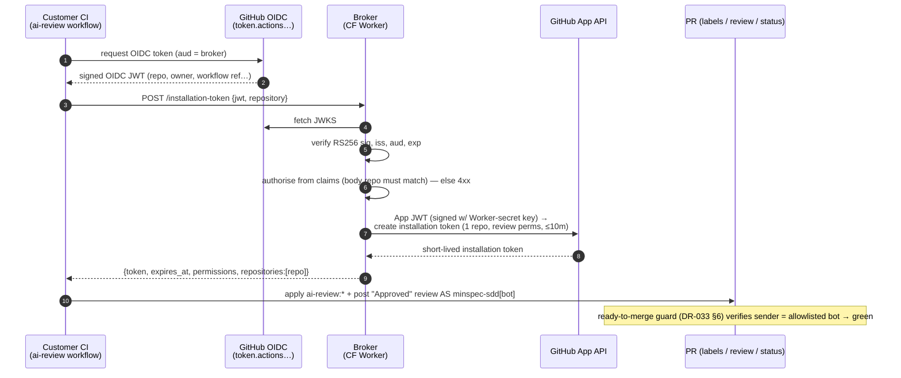

# OIDC Review Token-Broker — Plan

Plan phase for [SPEC-034](./requirements.md). Realises the reviewer-identity seam decided in
[DR-054](../../../docs/decisions/DR-054.md) §4: a vendor-operated broker that lets a reviewer
running in the customer's own CI post its verdict **as `minspec-sdd[bot]`** without ever
holding the shared App's private key. **Nothing here is built** — this is the Plan artifact;
every component below is *specified, not built*.

## Approach

A **stateless Cloudflare Worker** (OQ-3) is the whole broker. One route,
`POST /installation-token`, performs a three-step exchange and returns a short-lived,
repo-scoped GitHub App installation token:

1. **Verify** the caller's GitHub Actions **OIDC JWT** against GitHub's published JWKS
   (`token.actions.githubusercontent.com`, RS256) — signature, `iss`, `aud` (the broker's
   configured audience), expiry.
2. **Authorise** from the *verified claims only*: the `repository` / `repository_owner`
   claims are the source of truth; the request body's `repository` is a cross-check that must
   agree (confused-deputy defence, FR-2). Resolve the `minspec-sdd` App's installation on that
   repo; absent ⇒ 403 "install the App."
3. **Mint** an installation token scoped to that **one** repository and the **least-privilege**
   `review` permission set, TTL ≤10 min — by signing the App JWT with the private key held
   **only** in a Worker secret, then calling the GitHub App API.

The Worker is **credential-free toward the customer and content-free** — it receives only the
OIDC JWT + repo id, never code/diff/spec/prompt (FR-6). It is the GitHub-token sibling of
[DR-017](../../../docs/decisions/DR-017.md)'s host-side *model-access* broker: same shape
(credential-free client → broker injects the real credential), **disjoint** seam (a GitHub
token minted here can never reach a model endpoint, and a model credential can never mint a
GitHub token — OQ-6 non-crossing invariant).

**Fail-closed** is structural: any verification/authorisation/minting failure returns 4xx with
no token, so the reviewer cannot post `ai-review:pass`, so `ready-to-merge` stays red
([DR-033](../../../docs/decisions/DR-033.md) §6 guard is unchanged; it just receives a
trustworthy applier). A broker outage blocks merges, never green-lights them.

**Enterprise override needs no broker at all** (OQ-4): when a customer app-id secret +
`AI_REVIEW_BOT_LOGINS` are configured, the workflow mints via GitHub's native
`create-github-app-token` action with the customer's own key — the vendor Worker is never
called on that path.

## Architecture



Boundary / custody (what lives where):

```
Customer repo/CI          Vendor (AIClarity)              GitHub
────────────────          ──────────────────              ──────
ai-review workflow  ──►   CF Worker (stateless)     ──►   App API
  id-token: write           • App PRIVATE KEY (secret)      OIDC JWKS
  no App key                • JWKS verify (jose)            installation tokens
  posts as bot              • NO artifact storage
                            • content-free audit → log sink
Enterprise override:  ai-review workflow ──► GitHub native create-github-app-token
  (customer's own app-id + key as their secret; vendor Worker NOT in the path)
```

## API

`POST /installation-token`

```ts
// Request — Authorization carries the GitHub Actions OIDC JWT (aud = broker).
interface TokenRequest {
  repository: string;            // "owner/repo" — cross-checked against the OIDC claim
  permissions_profile: 'review'; // only profile in v1
}

// 200 — success
interface TokenResponse {
  token: string;                 // ghs_… installation token
  expires_at: string;            // ISO-8601, ≤10 min out
  permissions: {                 // least-privilege 'review' profile
    issues: 'write';             // apply ai-review:* labels
    pull_requests: 'write';      // post the review comment + GH-native Approved review
    checks: 'write';             // set the ai-review check-run
    statuses: 'write';           // set ready-to-merge commit status
  };
  repositories: [string];        // exactly one — the claim repo
}

// 4xx — fail-closed; never a token
interface TokenError { error: ErrorCode; reason: string }
type ErrorCode =
  | 'oidc_invalid'          // 401 bad sig / iss / aud / expired            (FR-1, AC-1)
  | 'repo_claim_mismatch'   // 403 body repo ≠ OIDC claim                   (FR-2, AC-2)
  | 'app_not_installed'     // 403 minspec-sdd not installed on the repo    (FR-4, AC-4)
  | 'rate_limited'          // 429 per-repo/org limit                       (NFR-2)
  | 'mint_failed';          // 502 GitHub App API error (no token returned) (FR-9, AC-9)
```

The `review` profile is the exact set the reviewer needs and no more — no `contents`, no
admin, no org scope (FR-3). GH-native *Approved* review (OQ-1 / AC-12) is covered by the
`pull_requests: write` already in the profile, so no scope change is needed to add it.

## Key decisions (reference, not re-decided)

| Decision | Where decided |
|---|---|
| Shared published App + broker; customer-own-app override | [DR-054](../../../docs/decisions/DR-054.md) §4 |
| Broker pattern (credential-free client → broker injects cred) | [DR-017](../../../docs/decisions/DR-017.md) |
| Provenance guard is authoritative; broker only feeds it a trustworthy applier | [DR-033](../../../docs/decisions/DR-033.md) §6 / `ai-review-guard.js` |
| Tier-2 (metadata/GitHub egress; no code/prompts) | [DR-004](../../../docs/decisions/DR-004.md) / DR-054 §2 |
| CF Worker substrate · any-repo access · content-free ≤30d audit · native-action override · model seam out of scope | SPEC-034 Clarify (OQ-1..6) |

## Dependency budget

**2 new deps (within the 2-3 "complex" budget, CLAUDE.md).** Both are security-critical
primitives it would be reckless to hand-roll:

- **`jose`** — JWKS fetch + RS256 OIDC-JWT verification. Hand-rolling JWT verification in
  WebCrypto is a classic footgun (alg-confusion, `kid` handling); `jose` is the vetted choice
  and runs on the Workers runtime.
- **`@octokit/auth-app`** — signs the App JWT and mints the scoped installation token with the
  correct `repositories` + `permissions` shape. Removes bespoke App-JWT crypto + API plumbing.

No dependency is shipped in the vsix or the customer repo — they live only in the Worker.

## Vertical slices (thinnest end-to-end first; T0 invariants lead)

Per CDD, build one path end-to-end, then widen. **T0 invariant ACs (AC-2/5/6/8/9/10) are
written before the code they guard.**

1. **Slice 1 — happy-path seam (thinnest e2e).** Valid OIDC → repo-scoped token → workflow
   applies `ai-review:pass` as `minspec-sdd[bot]` on a fixture PR. Proves the whole seam.
   *(AC-3, AC-7; cross-cutting invariants AC-5 key-custody, AC-6 no-artifact-egress asserted
   from here.)*
2. **Slice 2 — fail-closed + provenance (T0-heavy).** Bad OIDC→401, confused-deputy→403,
   App-not-installed→403, broker-down→red, guard green **only** on a bot-applied label.
   *(AC-1, AC-2, AC-4, AC-8, AC-9.)*
3. **Slice 3 — GH-native Approved review** on a passing PR whose author ≠ bot. *(AC-12.)*
4. **Slice 4 — enterprise override.** Config-driven identity via native
   `create-github-app-token`; no vendor-broker call; contract test asserts identity is read
   from config, never hardcoded. *(AC-10.)*
5. **Slice 5 — zero-config default + audit.** Fresh repo (App-install grant only) posts as the
   default bot; content-free audit records, ≤30d retention. *(AC-11, AC-13.)*

## Out of scope (unchanged from requirements)

Model access / which LLM the reviewer calls (Tier-1; #74 / SPEC-031 / DR-017's model broker);
the reviewer's prompt/verdict logic (SPEC-031); branch-protection provisioning (SPEC-033);
the solo/local `approvals.json` path ([DR-050](../../../docs/decisions/DR-050.md)).

## For the Tasks phase

/tasks will break the five slices into ordered, checkable items, T0 tests first. Two Plan-time
confirmations remain (not decisions): the CF free-tier-vs-SLO check (NFR-3) and the audit
log-sink choice (CF Logpush vs Workers Analytics Engine, OQ-5). Both resolve inside Slice 1/5,
not before.
