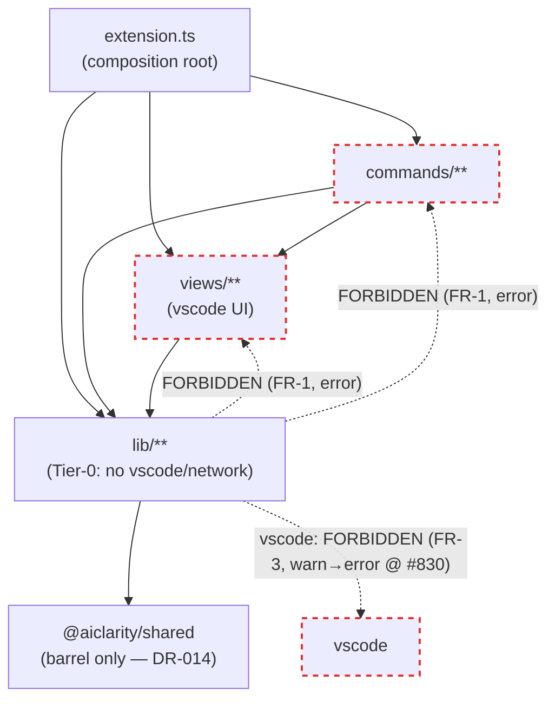

# SPEC-040 — Plan (Design)

Turns the layer-import contract from convention into machine-enforced gates. The three
load-bearing choices are already fixed by **[DR-064](../../../docs/decisions/DR-064.md)**
(OQ-1 in-repo cycle checker, OQ-2 ban type edges too, OQ-3 `@typescript-eslint/no-restricted-imports`
+ `parserOptions.project`). This Plan resolves the one Plan-level choice (OQ-4 — where relocated
helpers land), specifies the file plan, and sequences the work so `main` is never red.

## Dependency budget — 0 new runtime/dev deps

Confirmed against DR-064 §1/§3: `@typescript-eslint/{eslint-plugin,parser}` and `typescript`
are already dependencies (the root `eslint.config.mjs` imports the first two today; the cycle
checker parses imports with the already-present `typescript`). Nothing added. This sits inside
the CLAUDE.md budget (0–1 for the eslint work; the refactors add none).

## Architecture — the layer model this gate encodes

Allowed edges point **downward** only. `lib` is Tier-0 (DR-014): no `views`, no `commands`,
no `vscode`, and `@aiclarity/shared` consumed barrel-only. The two current `lib→views`
inversions (dashed red) are removed by FR-5 **before** the `error` rules land.

**Allowed-edge set (the costly-to-reverse artifact — SPEC-040 §Costly to Refactor).** `lib →
{lib, @aiclarity/shared(barrel)}` only. `views → {views, lib, shared, vscode}`. `commands →
{commands, views, lib, shared, vscode}`. `extension.ts → anything`. `src/test/**` and
`src/__benchmarks__/**` are exempt (they legitimately import views/vscode). Loosening this set
later silently re-opens the door — treat any addition as an architectural change (a DR-064 amendment).

## File plan

### Owned (new) — declared in `implements:`
| File | FR | Purpose |
|---|---|---|
| `packages/minspec/src/lib/spec-catalog.ts` | FR-4 | New Tier-0 home for the **recursive** `listSpecs` (moved from `views/spec-tree-provider.ts`). |
| `packages/minspec/src/lib/spec-progress.ts` | FR-5a | New Tier-0 home for `fromFrontmatter`/`computeProgress` + the `StatusBarSpec` type (moved from `views/status-bar.ts`). OQ-4 resolution below. |
| `packages/minspec/src/lib/import-cycle-check.ts` | FR-2 | Pure value-import-graph builder + three-color-DFS cycle finder (adapts `next-task.ts` `detectCycles`). No vscode, no network. |
| `scripts/check-import-cycles.ts` | FR-2 | Thin CLI runner (`npx tsx`, mirrors `validate-frontmatter.ts`); `exit 1` on any value cycle. Wired as `npm run check:cycles`. |
| `packages/minspec/tests/{spec-catalog,spec-progress,import-cycle-check,import-boundaries}.test.ts` | AC-6/7,AC-1..5 | See Test plan. |

### Touched (not owned) — `affects:` finalised at Tasks/Implement, **not** now
Deliberately kept out of `requirements.md` frontmatter while the approval is stale: SPEC-038's
gate edit-locks `affects:` paths identically to `implements:` (FR-2 design note), so declaring
these real, shared files under an unapproved spec would block concurrent edits to them. Recorded
here as the Plan-of-record; promoted to `affects:` at Implement (post re-approval):
`eslint.config.mjs` (the layering rules — FR-1/FR-3), `views/status-bar.ts`, `lib/active-spec.ts`
(FR-5a consumers), `lib/approval-diff.ts` (FR-5b), `views/spec-tree-provider.ts`,
`lib/spec-manager.ts`, `views/spec-panel.ts` (FR-4 disambiguation), `commands/{approve,approve-active,validate}.ts`
(FR-4 import repoint), `package.json`, `packages/minspec/tsconfig.json` (`parserOptions.project`).

## Prerequisite refactor A — extract the recursive `listSpecs` (FR-4)

**Move.** `views/spec-tree-provider.ts:36` `listSpecs(rootDir): SpecSummary[]` (recursive; walks
product/feature subfolders) → `lib/spec-catalog.ts`, exported unchanged. `spec-tree-provider.ts`
imports it back from `lib` (allowed direction) and keeps `SpecTreeProvider` + `ListSpecsFn` DI seam.
The three consumers repoint:
- `commands/approve.ts:3`, `commands/approve-active.ts:5`, `commands/validate.ts:3` change
  `from '../views/spec-tree-provider'` → `from '../lib/spec-catalog'` (they import `listSpecs` +
  `type SpecSummary`; `spec-catalog` re-exports `SpecSummary` from `lib/spec-manager` for a one-line diff).

**Disambiguation (the naming collision).** A *second, different* `listSpecs` — the **shallow,
top-level-only** scan at `lib/spec-manager.ts:406` (consumed by `views/spec-panel.ts`) — misses
product-nested specs (`specs/minspec/SPEC-040/…`). Decision: **rename the shallow one
`listSpecsShallow`** and repoint `spec-panel.ts`; behaviour-preserving (INV-2), no consolidation.
The nested-miss is a **latent `spec-panel` bug**, surfaced per R4 as **[#877](https://github.com/AIClarityAU/minspec/issues/877)**,
**not** silently fixed inside this refactor (fixing it would change `spec-panel` output — scope creep).

## Prerequisite refactor B — reverse the two `lib→views` inversions (FR-5)

**FR-5a — `fromFrontmatter`/`computeProgress`.** Both are already pure (import only `lib/config`
`PHASES`/`DEFAULT_CONFIG` and `lib/spec` types — no vscode). Move them plus the `StatusBarSpec`
return type from `views/status-bar.ts` into **`lib/spec-progress.ts`**. `views/status-bar.ts` and
`lib/active-spec.ts:6` both import from `lib/spec-progress` (down-edges). Removes the one value
`lib→views` edge.

**FR-5b — `SpecNode` type edge.** `lib/approval-diff.ts:21` type-imports `SpecNode` from
`views/spec-tree-provider`, using only `arg.spec.filePath` (line 127). Replace with a local minimal
type in `approval-diff.ts`: `type SpecNodeArg = { spec: { filePath: string } }`. The view's real
`SpecNode` (a `TreeItem` with `.spec: SpecSummary`) structurally satisfies it, so command wiring
passes it unchanged at runtime. Removes the one type `lib→views` edge. (`SpecSummary` already lives
in `lib/spec-manager.ts:25`; the view merely re-exports it — after this, `lib` imports nothing,
value or type, from `views`.)

## OQ-4 (resolved, Plan-level) — co-locate, don't grab-bag

Per DR-064 §5's lean: relocated helpers land beside their **most-related lib concern**, not in a
catch-all `lib/util`. `fromFrontmatter`/`computeProgress` are phase/progress derivations over
`SpecFrontmatter.phases` → cohesive new module **`lib/spec-progress.ts`**. The `SpecNodeArg` subset
has exactly one consumer → **local to `lib/approval-diff.ts`**. No `lib/util` created.

## FR-1 — direction + depth rules (eslint, `error`)

Add to root `eslint.config.mjs`: `parserOptions.project` (the minspec + shared tsconfigs) so the
parser sees type-only imports (DR-064 §3), then a `packages/minspec/src/lib/**`-scoped block using
`@typescript-eslint/no-restricted-imports` with `allowTypeImports: false`:
- ban patterns `../views`, `../views/*`, `../commands`, `../commands/*` (value **and** type — OQ-2).
- Repo-wide block: ban deep `@aiclarity/shared/*` (allow the bare `@aiclarity/shared` barrel — DR-014/AC-2).
- `files` excludes `**/src/test/**` and `**/src/__benchmarks__/**`.

These land at `error` only **after** FR-4/FR-5 make the tree clean (AC-5), so `main` never goes red.

## FR-3 — vscode-purity rule (`warn`)

A second `lib/**`-scoped `no-restricted-imports` entry bans `vscode` at **`warn`**. 7 files violate
today (`resolve-folder, diagnostics, active-spec, ai-usage-detector, approval-diff, bridge, active-adr`).
AC-3 asserts the warn **count == 7** by test, so the `warn`→`error` flip when #830 lands is a
one-line change verified by the same test. Never dodged via per-file `eslint-disable` (INV-4).

## FR-2 — the in-repo cycle gate (`error`)

`lib/import-cycle-check.ts`:
1. **Build the value-import graph** of `packages/minspec/src`. For each `.ts` (excluding
   `test/**`, `__benchmarks__/**`), parse with the `typescript` compiler API
   (`ts.createSourceFile`), walk `ImportDeclaration`s, and record an edge **only for value
   imports** — skip `importClause.isTypeOnly` and drop type-only named specifiers
   (`import { type X }`). Resolve relative specifiers to on-disk `.ts` files (mirror TS module
   resolution for `./`/`../`; ignore bare/`@aiclarity/*` specifiers — not in-package).
2. **Detect cycles** with the iterative three-color DFS ported from `next-task.ts:327`
   `detectCycles` (explicit stack, deterministic neighbour order, O(V+E) — no recursion). A GRAY
   back-edge names the exact member chain.
3. Export `findValueImportCycles(srcRoot): ImportCycle[]`.

`scripts/check-import-cycles.ts` imports it, prints any cycle's member path, and `exit(1)`.
`package.json` gains `"check:cycles": "npx tsx scripts/check-import-cycles.ts"`; CI (and the
pre-commit/lint chain) runs it. **Zero runtime cycles today** (the three known cycles are
type-only-closed), so the gate ships green and guards every future `type`→value flip (AC-4).

## FR-6 — deferred (not built here)

Dissolving the three type-held cycles is fragility-reduction, not gate-required (the gate flags
runtime cycles; there are none). Out of scope; tracked as a follow-up, not a blocker.

## Sequencing (why order matters — AC-5)

1. **FR-4** extract `listSpecs` → `lib/spec-catalog`, disambiguate shallow scan, repoint 3 commands + `spec-panel`. Suite green (AC-7).
2. **FR-5** move `spec-progress` helpers + local `SpecNodeArg`. Now zero `lib→views` edges. Suite green.
3. **FR-2** add `lib/import-cycle-check.ts` + runner + `check:cycles` script (ships green — zero runtime cycles).
4. **FR-1** add `parserOptions.project` + direction/depth `error` rules — now green because 1–2 cleaned the tree.
5. **FR-3** add the vscode `warn` rule; assert count == 7.

Each step is independently committable and suite-green; the `error` rules are physically added last.

## Test plan (→ acceptance criteria)

| Test | Asserts | AC |
|---|---|---|
| `import-boundaries.test.ts` — lint a `lib` fixture importing `../views` (value) and (type) | both error | AC-1 |
| ” — deep `@aiclarity/shared/src/x` vs barrel | error / pass | AC-2 |
| ” — a `lib` fixture importing `vscode`; assert **7** real warnings on the tree | warn, count==7 | AC-3, AC-5 |
| `import-cycle-check.test.ts` — synthetic value back-edge fixture; and the real `src` tree | cycle found / zero | AC-4, AC-5 |
| `spec-catalog.test.ts` — recursive scan parity with pre-move behaviour; consumers resolve from `lib` | behaviour-preserving | AC-6 |
| full `vitest run` across every step | unchanged | AC-7 |

## Risks (deltas from requirements R1–R4)

- **R3 measurement (owed by this Plan).** Before FR-1 lands at `error`, measure `npm run lint`
  wall-time with `parserOptions.project` enabled vs today. If type-aware linting is unacceptably
  slow, fall back to value-only `no-restricted-imports` (OQ-2 "allow type-only") per DR-064 §3 —
  a strictly weaker but still-directional rule — **not** abandoning the gate. Record the number.
- R1/R2/R4 unchanged; R4's `spec-panel` nested-miss is filed as a surfaced bug, not carried.

## Out of scope (mirrors requirements)

Relocating the 7 vscode-coupled `lib` files (#830 — flips FR-3 to error); dissolving the three
type-held cycles (FR-6); dependency-graph *reporting* / fan-in-out metrics (#195/#88); splitting
the god files (`spec-validator.ts`, `extension.ts`).
