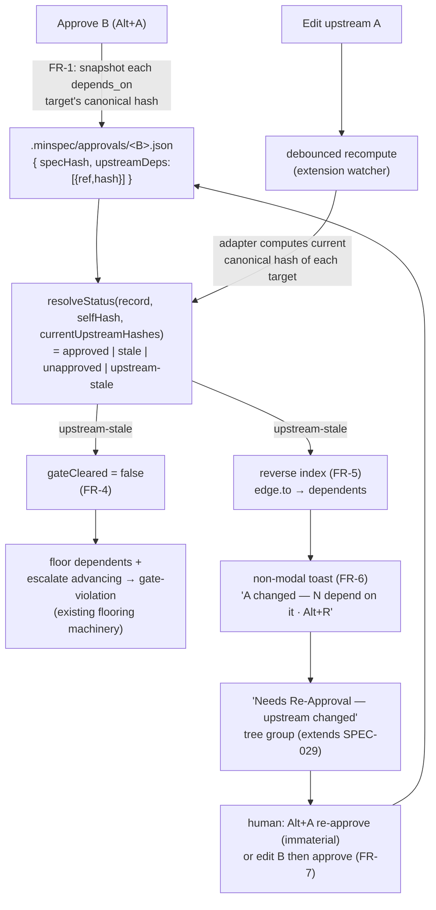
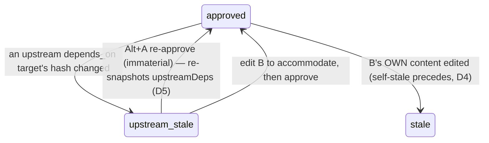

# MinSpec — Cross-artifact approval staleness (Plan)

**Reads:** [requirements.md](requirements.md) — FRs, invariants, and the Clarify resolutions (FR-OQ1..4) are settled there and not re-litigated. This document is **HOW**, not WHAT/WHY. Governed by [DR-062](../../../docs/decisions/DR-062.md).

## Approach

One primitive, applied to the existing machinery: *snapshot at approve, derive on read, propagate through the resolver's existing gate, surface to the human*. **No new subsystem, no new npm dependency.** Three vertical slices (order load-bearing — Slice 1 before Slice 2, per requirements R2):

1. Give ADR/epic the same committed hash-locked record specs already have.
2. Add `upstreamDeps` fingerprints + a derived `upstream-stale` state.
3. Reverse-index + HITL surface (toast, group, re-ack).

Every piece reuses an existing seam: the canonical-hash primitive ([canonical.ts](../../../packages/shared/src/canonical.ts)), the path-keyed record store ([approval-store.ts](../../../packages/minspec/src/lib/approval-store.ts)), the resolver's `gateCleared`/flooring ([next-task.ts](../../../packages/shared/src/next-task.ts)), and SPEC-029's staleness UX.

## Key decisions

- **D1 — pure core, fs adapter provides current hashes (DR-004 / DR-019).** `resolveStatus` stays a pure Tier-0 function; it receives the target's *current* canonical hashes from the fs adapter (mirrors the existing core/adapter split where the adapter computes and the core decides). No I/O, no network in the decision path (INV-2/INV-5).
- **D2 — reuse the canonical primitive for all three kinds.** `canonicalizeSpec` already strips `status`/`phases` before hashing, so a tool status-flip never voids a record while a content edit does. This is exactly the semantics ADRs/epics need — generalise the name to `canonicalizeApprovable`, no behaviour change (INV-4).
- **D3 — `depends_on` only; hashes in the committed sidecar** (Clarify OQ2/OQ3). Advisory `relates_to` and pruning `supersedes` are excluded; the `{ref, hash}` pairs live in the committed path-keyed record so a fresh clone / CI computes the identical verdict.
- **D4 — self-stale takes precedence over upstream-stale.** If B's own content also drifted, report `stale` (the more direct "you edited this"); only an otherwise-clean B with a drifted upstream reports `upstream-stale`.
- **D5 — re-ack reuses the existing Approve (Alt+A).** Re-approving a self-unchanged B re-snapshots its `upstreamDeps` (FR-1 runs in the approve path) and clears `upstream-stale` — so FR-7 needs **no new keybinding**; the human re-attests B as a whole. A lighter dedicated "refresh fingerprints" command (skip the self-hash re-lock) is an optional refinement, not v1.
- **D6 — the "what changed" view reuses the *upstream's* own SPEC-029 self-diff.** We store only the upstream hash, not its old bytes, so v1 surfaces *"A changed since you approved B — review A"* and links A's existing what-changed diff. A precise B-relied-on-this-section cross-diff needs section anchors and is deferred to [#862](https://github.com/AIClarityAU/minspec/issues/862). No new baseline storage.

## Architecture



## API / Contracts

```ts
// packages/shared — the pure contract (no vscode, no network)

/** A fingerprint of one depends_on target, captured at approve time. */
interface UpstreamDep {
  ref: string;          // e.g. "DR-019" | "SPEC-012" (whole-doc; anchors are #862)
  hash: string;         // canonical sha256 of the target at B's approval
  refState?: string;    // OPTIONAL advisory: target's derived status at snapshot (FR-OQ1 nice-to-have)
}

// approval record gains ONE optional, backward-compatible field:
interface ApprovalRecord {
  // …existing: specPath, specHash, approvedAt, approvedBy, tier, migrated, baselineBlob
  upstreamDeps?: UpstreamDep[];   // absent ⇒ pre-SPEC-041 behaviour (no cross-artifact check)
}

type ApprovalStatus = 'approved' | 'stale' | 'unapproved' | 'upstream-stale'; // + upstream-stale

/** Pure. self-stale precedes upstream-stale (D4). */
function resolveStatus(
  record: ApprovalRecord | null,
  currentSelfHash: string,
  currentUpstreamHashes: ReadonlyMap<string, string>, // ref → current canonical hash
): ApprovalStatus;

/** FR-5 — inverse of the forward blockers map, keyed by edge.to. Pure. */
function buildDependentsIndex(graph: ArtifactGraph): ReadonlyMap<string, string[]>; // targetRef → [dependentRef]

/** FR-5/FR-6 — given an edited artifact, the approved dependents whose recorded hash no longer matches. */
function affectedDependents(
  editedRef: string,
  graph: ArtifactGraph,
  records: ReadonlyMap<string, ApprovalRecord>,
): string[];
```

```json
// Example extended sidecar — .minspec/approvals/specs/minspec/SPEC-041-…/requirements.md.json
{
  "specPath": "specs/minspec/SPEC-041-cross-artifact-staleness/requirements.md",
  "specHash": "sha256:…",
  "approvedBy": "github@harvest316.com",
  "tier": "T3",
  "upstreamDeps": [
    { "ref": "SPEC-022", "hash": "sha256:…" },
    { "ref": "SPEC-012", "hash": "sha256:…" }
  ]
}
```

## UX

Non-modal, keyboard-first, never focus-stealing (HITL-UX rule). Toast appears on the debounced recompute after an upstream save; the tree group extends SPEC-029's "Needs Re-Approval".

```
 ┌──────────────────────────────────────────────────────────┐
 │  ⚠  DR-019 changed — 3 approved artifacts depend on it.   │
 │                                   [ Alt+R  Review ]  [ × ] │   ← non-modal toast (FR-6)
 └──────────────────────────────────────────────────────────┘

 EXPLORER · MinSpec
 ▸ Needs Re-Approval — upstream changed          (extends SPEC-029 group)
     ● SPEC-014   ⇠ DR-019 changed         [Alt+A re-approve] [open DR-019 diff]
     ● SPEC-021   ⇠ DR-019 changed         [Alt+A re-approve] [open DR-019 diff]
     ● EPIC-004   ⇠ DR-019 changed         [Alt+A re-approve] [open DR-019 diff]
   Needs Re-Approval — self edited                (existing SPEC-029 group)
     ● SPEC-030   (edited since approval)   [Alt+A re-approve]
```



Keys: **Alt+A** = existing Approve (doubles as re-ack, D5). **Alt+R** = focus the "upstream changed" group (new; subject to a free-binding check at implement, shown in tooltip per the hotkey-visibility rule).

## Slice plan (files touched)

**Slice 1 — ADR/epic hash-locked records (FR-2, FR-8).**
- `approval-store.ts` — already path-keyed; accept ADR/epic paths (generalise the `spec`-specific naming).
- `adr-manager.ts` `setAdrStatus`→accept path, `epic-manager.ts` `setEpicStatus`→accept path — mint an attributed, canonical-hashed record on accept (reuse commit-on-approve).
- `canonical.ts` — rename `canonicalizeSpec`→`canonicalizeApprovable` (no behaviour change).
- One-shot migration command — backfill `migrated:true` records for already-accepted ADRs/epics.

**Slice 2 — upstreamDeps + upstream-stale (FR-1, FR-3, FR-4).**
- `approval.ts` — `ApprovalRecord.upstreamDeps`; snapshot in `approveSpec`/`acceptAdr`/`acceptEpic` (resolve `depends_on` targets → files → canonical hash); extend `resolveStatus` (D4 precedence).
- `next-task.ts` — `ApprovalState` gains `'upstream-stale'`; `gateCleared` returns false for it; `pendingApproval` node generation surfaces it.
- `artifact-graph.ts` (adapter) — compute each artifact's current upstream target hashes and feed the resolver.

**Slice 3 — reverse index + HITL (FR-5, FR-6, FR-7).**
- `next-task.ts` — `buildDependentsIndex` / `affectedDependents` (pure).
- `spec-tree-provider.ts` — the "upstream changed" group (extend SPEC-029's `getNeedsReapprovalGroup`).
- `extension.ts` — on the existing debounced watcher, raise the toast + register the Alt+R command; FR-7 re-ack reuses the existing Approve command (D5).
- `approval-diff.ts` — reuse to open the *upstream's* self-diff (D6).

## Out of scope (tracked)

- **Commit/CI implement-gate** — DR-062 §3, [#861](https://github.com/AIClarityAU/minspec/issues/861).
- **Section/paragraph anchors + precise cross-diff** — DR-062 §6, [#862](https://github.com/AIClarityAU/minspec/issues/862) (D6 is the whole-doc interim).
- **Trustworthy edges** (symmetric linter + provenance) — [#803](https://github.com/AIClarityAU/minspec/issues/803), the precondition for trusting bulk-approved edges.
- Legs B ([#643](https://github.com/AIClarityAU/minspec/issues/643)) and C ([#804](https://github.com/AIClarityAU/minspec/issues/804)).

## Dependency budget

**0 new dependencies.** Everything reuses in-repo primitives (canonical, approval-store, resolver, `approval-diff`, git blob/config, vscode tree/toast APIs). Within CLAUDE.md's 0-1 budget for a change of this shape.

## Test strategy (tiers)

- **T0 (invariants, before implementation):** INV-1 — a staleness recompute performs **zero writes** to any sidecar (assert byte-identical records around a recompute). INV-2/INV-5 — `resolveStatus` is deterministic and reaches no network/LLM (fixture → byte-identical verdict across N runs; no I/O in the pure path). INV-4 — a tool status-flip on an accepted ADR/epic does **not** void its record; a content edit does.
- **T1 (contract):** `resolveStatus` truth-matrix over {no record, self-hash match/mismatch, each upstream match/mismatch}, incl. the D4 precedence; `buildDependentsIndex`/`affectedDependents` exactness (AC-4).
- **T2 (feature, per slice):** AC-1 (ADR/epic record + edit→stale), AC-2 (approve snapshots + upstream edit→upstream-stale, B bytes unchanged), AC-3 (floor/gate-violation), AC-5 (Alt+A re-ack clears + commits), AC-7 (migration backfill).
- **T3 (regression):** one per bug found during implement.

## Risks

Inherits requirements R1 (bulk-approved false edge → spurious upstream-stale; mitigated by #803, blast radius = one keystroke) and R2 (slice order — Slice 1 first). Added:
- **D6 interim.** v1 shows "upstream changed, review it", not a precise cross-diff — acceptable; the precise diff is #862. Documented so no reviewer reads it as a gap.
- **Migration (FR-8) must be idempotent** — re-running backfill on an already-recorded ADR/epic is a no-op; `migrated:true` marks backfilled records for later audit.
