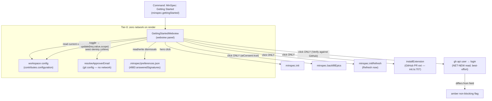

# MinSpec — Onboarding consolidation (Plan)

**Reads:** [requirements.md](requirements.md) — FRs, invariants (INV-1..6), the vertical slices, and the **now-settled** Open Questions (FR-OQ1..3, resolved in [Clarify](requirements.md#clarify) 2026-07-25/26: coverage field kept with the FR-11 seed framing; approver editable + offline-seeded + click-gated GitHub flag; `silentRefresh`/[#186] kept a dependency, rendered Planned). This plan was drafted ahead of Clarify against those proposals and **every one was ratified as proposed**, so its contingency held unchanged and the plan closes: `clarify: done`, `plan: done`. This document is **HOW**, not WHAT/WHY. Phase-2 work (constitution [Phases](../../../.minspec/constitution.md#L94)); must not displace an unmet Phase-1 item.

**Prototype:** the layout below realises the reviewed interactive prototype — private Artifact `ddfe8bfe-3c4e-433f-a15d-d60af692ef00` (**owner-only**; a design reference, never a shipped or shared asset). Where prose and prototype disagree, this document wins.

## Approach

One offline webview over settings that already exist. **No new subsystem, no new npm dependency.** The page is a faithful, re-openable view onto two existing stores — `contributes.configuration` ([package.json:462-530](../../../packages/minspec/package.json#L462)) and `.minspec/preferences.json` ([auto-bootstrap.ts:82/101](../../../packages/minspec/src/lib/auto-bootstrap.ts#L82)) — plus per-click dispatch to commands that already exist (`minspec.init`, `minspec.initRefresh`, `minspec.backfillEpics`, the GitHub PR install path). Three vertical slices (order per requirements): (1) read-only page + hero, (2) standing switches + meta-controls, (3) identity field + per-action buttons + seed.

## Key decisions

- **D1 — webview, not `contributes.walkthroughs`.** A VS Code **walkthrough** step is static markdown + `command:` links ([the existing `minspec.gettingStarted` walkthrough, package.json:533-581](../../../packages/minspec/package.json#L533)); it **cannot** host live toggles, an email field with format validation and a conditional amber flag, whole-row-click a11y, or "Backfill with AI" / "Refresh now" / "Install" action buttons. The consolidation page therefore ships as a **webview panel** opened by the `minspec.gettingStarted` command. The existing teaching walkthrough is kept as an optional companion and its steps deep-link into the page (`command:minspec.gettingStarted`); the walkthrough is *not* the consolidation surface. (Naming: the command is **MinSpec: Getting Started**; the pre-existing walkthrough title "Get Started with MinSpec" is left as-is to avoid churn.)
- **D2 — persistence reuses the [#883] preferences model; switches use the config API.** Page-local dismissals ("not now") write through the **same** `loadPreferences`/`savePreferences` + `answeredSignatures` machinery ([auto-bootstrap.ts:82](../../../packages/minspec/src/lib/auto-bootstrap.ts#L82), [:722](../../../packages/minspec/src/lib/auto-bootstrap.ts#L722)) — no second dismissal store (INV-3). Standing switches write their setting via `workspace.getConfiguration('minspec').update(key, value, scope)`, honoring each setting's declared scope (`approverEmail` is `scope: application` — [package.json:510](../../../packages/minspec/package.json#L510); the rest default to workspace/user).
- **D3 — per-action network consent, adopting existing gated paths.** The page holds **no** standing network authorization (INV-1/FR-14). Backfill dispatches `minspec.backfillEpics` with `{ aiConsent: true }` **only on click** (the same arg shape the toast uses — [auto-bootstrap.ts:592](../../../packages/minspec/src/lib/auto-bootstrap.ts#L592)); the GitHub-PR install (FR-17) reuses [`offerGitHubPrExtensionAdvisory`'s install path:707](../../../packages/minspec/src/commands/init.ts#L707) (explicit "Install" only); the "Refresh now" action (FR-16) dispatches the existing `minspec.initRefresh` on click; verifying the approver identity against GitHub (D4) is a click-gated, best-effort `gh api user` shell-out — the render itself stays offline.
- **D4 — approver identity: offline seed on render, click-gated GitHub verification, amber on divergence.** The identity row **renders with an offline value**: [`resolveApproverEmail`:92](../../../packages/minspec/src/commands/approve.ts#L92) returns `minspec.approverEmail` if set, else `git config user.email` — this is **purely local git config; `resolveApproverEmail` performs no `gh`/network read of any kind** (its own docstring: "Tier-0/offline: gitConfigEmail reads local git config only", [:96](../../../packages/minspec/src/commands/approve.ts#L96)). The `gh api user` read is a **net-new external capability this spec introduces** — it is **not** part of `resolveApproverEmail` — exposed as a **separate, explicitly-labelled "Verify against GitHub" action**, **click-gated** and best-effort (on any failure or air-gapped host it simply does not verify; the offline value stands, nothing hangs or networks). If the entered value is a valid email that **differs** from the verified `gh` login, the row shows the non-blocking amber flag (FR-5). The page writes **only** `minspec.approverEmail` — it never mints an approval record; the DR-056 gate ([approve.ts:240](../../../packages/minspec/src/commands/approve.ts#L240)) remains the sole adjudicator (INV-4). *No network on render (INV-1); the `gh` read is the click.*
- **D5 — default flip is a one-line contributes change, back-compat-safe.** `minspec.advancePhaseOnApprove` default `false → true` ([package.json:504](../../../packages/minspec/package.json#L504)). VS Code applies a contributed default **only** where the user has not set the key, so an explicit prior value is preserved (INV-5). `advancePhaseOnApproveEnabled()` ([approve.ts:108](../../../packages/minspec/src/commands/approve.ts#L108)) reads the effective value and needs no code change beyond the default.
- **D6 — unified commit consent is a labeling + [#758] runtime decision.** The page binds **one** switch to `minspec.commitOnApprove` ([package.json:492](../../../packages/minspec/package.json#L492)) covering "approvals + harness refreshes." The approvals half is live today; broadening the **runtime** so a harness refresh (`minspec.commitHarnessRefresh`, [package.json:76](../../../packages/minspec/package.json#L76)) also honors this one setting is [#758]'s change — the page surfaces the single consent regardless, and this design does not fork a second toggle.
- **D7 — row-click a11y is a row-type predicate.** A whole-row click flips a row **iff** `row.kind === 'toggle'`; `field` (email, coverage), `multi` (approvals), and `action`-bearing rows (the refresh row's "Refresh now", the Backfill/Install buttons) are excluded (FR-10). Keyboard: each toggle row is a `role="switch"` reachable by Tab and flipped by Space/Enter; where a row carries a keybinding, it renders in a persistent trailing tooltip/label (FR-9, keyboard-first — shown where it exists, not manufactured per row).

## Architecture



## API / Contracts

```ts
// packages/minspec/src/lib/onboarding-settings.ts — the pure view model (no network on build).

type RowKind = 'toggle' | 'field' | 'multi' | 'action';

interface OnboardingRow {
  settingId?: string;         // e.g. "minspec.commitOnApprove" — the real contributed key (undefined for pure actions)
  commandId?: string;         // e.g. "minspec.initRefresh" — for 'action' rows (Refresh now, Backfill, Install)
  tier: 'required' | 'recommended' | 'optional';
  kind: RowKind;              // D7: only 'toggle' rows are whole-row clickable
  planned?: boolean;          // true → rendered disabled with a "Planned" tag (silentRefresh #186; INV-5)
  hotkey?: string;            // shown when present (FR-9 — not required per row)
  rowClickToggles: boolean;   // derived: kind === 'toggle' && !planned
}

interface OnboardingModel {
  hero: { commandId: 'minspec.init'; label: 'Initialize SDD structure' };
  primer: [string, string, string, string];   // the 4 #156 points; no progress meter field exists (INV-2)
  rows: OnboardingRow[];
  showSettingIds: boolean;    // default false (FR-9)
  scroogeNudgeShownOn: true;  // FR-12: no off-control on this page
}

// Identity (D4) — offline seed on render; gh read is click-gated (net-new, NOT in resolveApproverEmail).
interface ApproverIdentity {
  value: string;              // render-time: resolveApproverEmail() — minspec.approverEmail or git config (offline, no network)
  ghLogin: string | null;     // null until the user clicks "Verify against GitHub"; then `gh api user` login, or null if unavailable/air-gapped
  valid: boolean;             // email-format check
  divergesFromGh: boolean;    // valid && ghLogin && value !== ghLogin  → amber flag (non-blocking), only computable post-verify
}
```

```
Row inventory (authoritative settings/commands — every id below is real in the codebase
except silentRefresh, which is Planned #186):

REQUIRED     hero  Initialize SDD structure ............ minspec.init (command)
RECOMMENDED  ○→●  Silent harness refresh .............. minspec.silentRefresh   [Planned #186 · disabled]
             [▸]  Refresh harness now ................ button → minspec.initRefresh  (manual; distinct from Planned silentRefresh — FR-16)
             ○→●  Classify on commit ................. minspec.autoClassifyOnCommit
             ○→●  Commit MinSpec's own changes ....... minspec.commitOnApprove  (approvals + harness refreshes; never pushed)
             ○→●  Advance phase on approve ........... minspec.advancePhaseOnApprove  (default ON — D5)
             [✎]  Approver email .................... minspec.approverEmail  (offline seed; [Verify against GitHub] → amber if differs — D4)
OPTIONAL     [▸]  Backfill epics with AI ............. button → minspec.backfillEpics {aiConsent:true} (FR-8)
             [▸]  Install GitHub PR extension ....... button → installExtension (init.ts:707 — FR-17)
             [#]  Coverage minimum % ................ minspec.coverage.minimumPercentage  (seeds config/CI; NOT enforced — FR-11)
             ●    ScroogeLLM nudge .................. minspec.scroogellmNudge.enabled  (shown ON; no off here — FR-12)
FOOTER       ○→●  Offer setup automatically ......... minspec.autoBootstrap.enabled
             ○→●  Show setting ids .................. (view-only; default OFF — FR-9)
```

## UX

Non-modal, keyboard-first, theme-aware. All colors via VS Code webview theme tokens (`var(--vscode-foreground)`, `--vscode-editorWarning-foreground` for the amber flag, `--vscode-focusBorder`) so light/dark both work with no bespoke palette. A Phase-2 banner sits at the top (INV-6). **No progress meter** anywhere (INV-2).

```
 ┌─────────────────────────────────────────────────────────────────┐
 │  MinSpec · Getting Started              Phase-2 · public polish  │
 │  How MinSpec works:                                              │
 │   • Ceremony matches blast radius   • Verify signal, not content │
 │   • One next step, never a list     • Decisions are deterministic│
 ├─────────────────────────────────────────────────────────────────┤
 │  REQUIRED                                                        │
 │   ▶  Initialize SDD structure                       [ Run ]      │
 │  RECOMMENDED                                                     │
 │   ◑  Silent harness refresh            Planned · #186  (disabled)│
 │   ▸  Refresh harness now                [ Refresh now ]          │
 │   ●  Classify on commit                              Alt+…       │
 │   ●  Commit MinSpec's own changes  (approvals + refreshes)       │
 │   ●  Advance phase on approve                                    │
 │   ✎  Approver email  [ you@corp.com     ]  [ Verify against GH ] │
 │        ⚠ differs from your GitHub login — can't be auto-verified │
 │  OPTIONAL                                                        │
 │   ▸  Backfill epics with AI            [ Backfill with AI ]      │
 │   ▸  Install GitHub PR extension       [ Install ]              │
 │   #  Coverage minimum %  [ 80 ]  seeds config/CI · not enforced  │
 │   ●  ScroogeLLM tips (on)                                        │
 ├─────────────────────────────────────────────────────────────────┤
 │  ⚙ Offer setup automatically on activation      ●                │
 │  ⚙ Show setting ids                             ○   (off)        │
 └─────────────────────────────────────────────────────────────────┘
```

The approver row renders the offline email immediately; the amber warning line appears **only after** the user clicks **Verify against GitHub** and the returned `gh` login differs. Before any verify click the row is fully offline.

```mermaid
stateDiagram-v2
  render: page open (zero network — INV-1; identity seeded offline)
  render --> toggled: click a 'toggle' row → config.update(key,value,scope)
  render --> dismissed: "not now" → savePreferences(answeredSignatures) (#883)
  dismissed --> render: underlying state signature changes (re-appears)
  render --> networkAction: explicit click (Backfill / Install / Refresh now / Verify against GitHub)
  networkAction --> render: per-action consent satisfied; no standing authorization retained
```



Keys: a keyboard shortcut renders wherever a row carries one (FR-9 — shown where it exists, not fabricated per row); Space/Enter flips the focused switch; Tab order follows visual order. Any new keybinding is subject to a free-binding check at implement and shown in-tooltip (hotkey-visibility rule) — no per-row binding is required by this design.

## Slice plan (files touched)

**Slice 1 — read-only page + hero (FR-1, FR-2, FR-14; FR-9 on the hero row).**
- `packages/minspec/src/commands/getting-started.ts` *(new — owned)* — registers `minspec.gettingStarted`, opens the webview.
- `packages/minspec/src/views/getting-started-webview.ts` *(new — owned)* — the webview: primer, hero *Initialize* (`minspec.init`), read-only tier render; strict CSP, no network on render.
- `packages/minspec/src/lib/onboarding-settings.ts` *(new — owned)* — the pure `OnboardingModel` builder (no network); reads current config values and the offline `resolveApproverEmail` seed.
- `packages/minspec/package.json` *(affects)* — contribute the `minspec.gettingStarted` command; the existing walkthrough deep-links to it (D1).
- `packages/minspec/src/extension.ts` *(affects)* — register the command in `activate` (cheap, side-effect-free — constitution Constraints).

**Slice 2 — standing switches + meta-controls (FR-4, FR-6, FR-7, FR-9 meta-toggle, FR-10, FR-13).**
- `getting-started-webview.ts` — toggle rows → `config.update`; row-click predicate (D7); the "Show setting ids" meta-toggle; footer master; shortcut labels on rows that carry a binding.
- `onboarding-settings.ts` — `rowClickToggles` derivation; `silentRefresh` as `planned:true`.
- `package.json` *(affects)* — **flip `advancePhaseOnApprove` default `false → true`** (D5); label copy for the unified `commitOnApprove` consent (FR-7).
- `auto-bootstrap.ts` *(affects — reuse only)* — page-local dismissals call `savePreferences`/`answeredSignatures` (no behavior change to the module).

**Slice 3 — identity + per-action buttons + seed (FR-5, FR-8, FR-11, FR-12, FR-14, FR-16, FR-17).**
- `getting-started-webview.ts` — the approver field (offline seed) + click-gated **"Verify against GitHub"** action (D4) + amber flag; the per-action buttons — Backfill with AI (FR-8), Install GitHub PR extension (FR-17), Refresh harness now (FR-16) — each with per-click consent (D3); coverage seed field; shown-on Scrooge row.
- `onboarding-settings.ts` — `ApproverIdentity` compute (offline seed value + format check; divergence only after verify).
- `init.ts` *(affects — reuse only)* — call the existing `offerGitHubPrExtensionAdvisory` install path (Install button) from the button; dispatch the existing `minspec.initRefresh` (Refresh now). No new install/refresh logic.

## Out of scope (tracked)

- **Reading-time** ([SPEC-017]) and **conformance / auto-export-traceability** (`minspec.conformance.enabled`, [package.json:467](../../../packages/minspec/package.json#L467)) — cut for evidence-honesty (requirements FR-15).
- **The DESIGN.md-stub removal and tasks.md scaffold bootstrap steps** — two of the six [`BOOTSTRAP_STEPS`](../../../packages/minspec/src/lib/auto-bootstrap.ts#L528) offers are deliberately **not** surfaced as page rows (requirements Out of scope); they remain activation toasts under `autoBootstrap.enabled`.
- **`silentRefresh` behavior** — [#186]; this spec renders only the Planned switch and surfaces the built manual `minspec.initRefresh` action (FR-16) as the working refresh path.
- **Harness-refresh commit runtime broadening** — [#758]; the page surfaces the unified consent, the runtime change is #758's.
- **agent-execute onboarding** — [DR-015].
- **Retiring the activation toasts** — `autoBootstrap.enabled` governs whether they fire; the six-step toast machinery itself is unchanged by this spec (page and toasts share the [#883] memory).

## Dependency budget

**0 new dependencies.** Everything reuses in-repo seams: VS Code webview/config APIs, the [#883] preferences model, the existing `minspec.init` / `minspec.initRefresh` / `minspec.backfillEpics` commands, the offline `resolveApproverEmail` seed, and the [init.ts:707](../../../packages/minspec/src/commands/init.ts#L707) install path. The only external read introduced is the click-gated `gh api user` verification (D4) — a shell-out, not an npm dependency. Within CLAUDE.md's 0-1 budget.

## Test strategy (tiers)

- **T0 (invariants, before implementation):** INV-1 — a network-recording harness asserts **zero** network/external calls on open/render (identity seeded offline), and that Backfill/Install/Refresh-now/Verify-against-GitHub fire only on explicit click (AC-1, AC-6, AC-12, AC-13, AC-14). INV-2 — a DOM/structure test asserts **no** progress-meter/"N of M" element exists (AC-2). INV-3 — a dismissal round-trips through `answeredSignatures` and re-appears on a signature change (AC-3). INV-4 — the identity row renders the offline value with zero network and the page writes **only** `minspec.approverEmail`, never an approval record; the `gh` read fires only on the Verify click, and an air-gapped host renders without hanging (AC-5, AC-14). INV-5 — `silentRefresh` renders disabled/Planned; the `advancePhaseOnApprove` default flip preserves an explicitly-set value.
- **T1 (contract):** `onboarding-settings.ts` model builder — each row maps to its real `minspec.*` id / command id; `rowClickToggles` true **only** for non-planned `toggle` rows (AC-7); `ApproverIdentity` — offline `value` seed with no network, and the `divergesFromGh` truth table (only populated post-verify).
- **T2 (feature, per slice):** AC-4 (switch↔setting binding; defaults), AC-8 ("Show setting ids" off; footer; shortcut shown where a binding exists), AC-9 (coverage helper copy matches [package.json:528](../../../packages/minspec/package.json#L528)), AC-10 (Scrooge shown-on, never written false), AC-11 (no reading-time/conformance control), AC-12 (Refresh now → `minspec.initRefresh` on click only), AC-13 (Install button on click only, absent-button would fail).
- **T3 (regression):** one per bug found during implement.

## Risks

Inherits requirements R1 (default-flip back-compat — mitigated by VS Code's "default only where unset", D5), R2 (amber reads as block — copy + editable field + separate verify click, D4), R3 (toast/page double-surface — shared [#883] memory + `autoBootstrap.enabled`, D6/footer), and R4 (Phase-2 crowding Phase-1 — INV-6 banner + resolver rank). Added:
- **D1 walkthrough coexistence.** Two "getting started" entry points (the webview command and the pre-existing walkthrough) could confuse — mitigated by making the walkthrough deep-link into the page rather than duplicate it.
- **D4 `gh` shell dependency.** The GitHub verification needs `gh`; absent/air-gapped it simply does not verify and the offline seed stands (never blocks, never networks silently on render). Documented so a reviewer does not read the offline-only render as a gap.
- **~~Plan drafted ahead of Clarify~~ — retired 2026-07-26 (contingency held).** This plan *was* drafted ahead of Clarify and contingent on the FR-OQ1..3 proposals. Clarify ratified all three **as proposed**, so no revision to D4 or Slice 3 was needed and the plan closed at `plan: done`. Kept as a record of the risk and its resolution, not as a live risk.

## Traceability

- **Relates to:** [SPEC-018] (init prompts consumed), [SPEC-037] / [DR-056] (approver identity surfaced).
- **Builds on (merged):** [#883] preferences/`answeredSignatures` model.
- **Unify target:** [#758]. **Planned dependency:** [#186]. **Parent:** [#533].
- **Prototype (owner-only):** private Artifact `ddfe8bfe-3c4e-433f-a15d-d60af692ef00`.

[#533]: https://github.com/AIClarityAU/minspec/issues/533
[#883]: https://github.com/AIClarityAU/minspec/pull/883
[#758]: https://github.com/AIClarityAU/minspec/issues/758
[#186]: https://github.com/AIClarityAU/minspec/issues/186
[SPEC-018]: ../SPEC-018-spec-custom-editor/requirements.md
[SPEC-037]: ../SPEC-037-approver-identity/requirements.md
[SPEC-017]: ../SPEC-017-trust-dashboard/requirements.md
[DR-015]: ../../../docs/decisions/DR-015.md
[DR-056]: ../../../docs/decisions/DR-056.md