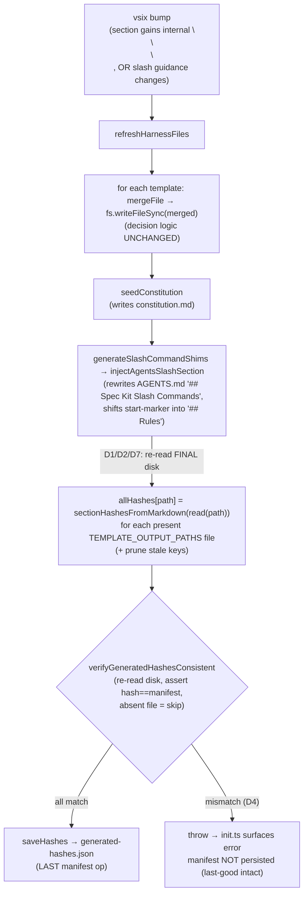

# MinSpec — Harness-refresh manifest consistency (Plan)

**Reads:** [requirements.md](requirements.md) — the RCDD, FRs, invariants, and the Clarify resolutions (OQ-1..4) are settled there and not re-litigated. This document is **HOW**, not WHAT/WHY. Traces to [#890](https://github.com/AIClarityAU/minspec/issues/890); governed by the constitution's [enforce-it-via-code](../../../.minspec/constitution.md#L17) invariant.

## Approach

One idea, two layers, applied to the existing machinery — **no new subsystem, no new npm dependency**:

1. **Hash exactly what is finally on disk.** After *every* write path has run — `mergeFile`'s per-file write, `seedConstitution`, and (critically) `generateSlashCommandShims`'s AGENTS.md slash-section injection — re-read each managed section-merge file and compute the manifest through one shared helper. The recorded hash equals the on-disk bytes *by construction*, no matter which mechanism last touched the file. This is strictly stronger than "hash what `mergeFile` returned": for AGENTS.md, `mergeFile`'s `merged` is **not** the final on-disk state.
2. **Fail closed against a future regression.** A deterministic write-time self-check re-reads the files and asserts manifest == hash-of-disk before persisting. Because layer 1 records that manifest from the *same* final disk the check re-reads, this is **green by construction today** — a fail-closed *tripwire*, not the active #890 fix (layer 1 is). It earns its place by aborting-without-persist if a *future* change ever records the manifest from a non-disk source (record-before-write); the same predicate also backs an independent commit/CI-time consistency check (#760). (Enforce, don't trust.)

Two vertical slices; **order is load-bearing** (Slice 1 before Slice 2, per requirements R2 — the gate must not land before the fix that makes it green).

## Key decisions

- **D1 — record from the FINAL on-disk bytes, not the pre-normalization body and not `mergeFile`'s return.** The original defect is that `hashSection(genSection.body)` / `hashSection(existingBody)` ([merge-refresh.ts:189/193/197/202/217](../../../packages/minspec/src/lib/merge-refresh.ts#L197)) is a *different transform* from `sectionsToMarkdown` ([:98](../../../packages/minspec/src/lib/merge-refresh.ts#L98)): `hashSection` `.trim()`s but never collapses an **internal** `\n{3,}`, while the file write does. But recording from `mergeFile`'s `merged` is **also insufficient** for AGENTS.md, because `generateSlashCommandShims` rewrites it afterwards (D7). So the manifest is derived from a **final disk re-read after all writes**. The merge **decision** logic (which body to keep) is untouched (INV-5); only the **recording** changes.
- **D2 — one shared helper, first-occurrence-wins.** `sectionHashesFromMarkdown(content)` = `parseSections` → `hashSection` per section, keeping the first occurrence of a duplicate heading, mirroring the existing preserve-pass rule ([:216-218](../../../packages/minspec/src/lib/merge-refresh.ts#L216)). Used to record every tracked file from disk and by the gate — so no two sites can hash a section differently. It **retires** the last-occurrence-wins `buildSectionHashes` as a recording path (its callers at `generateHarnessFiles` :767, `refreshHarnessFiles` :847, and `seedConstitution` :71 no longer feed the manifest). `buildSectionHashes` itself may remain for any non-manifest caller, but is no longer a manifest source.
- **D3 — gate lives in the pure lib, is called from the write paths.** `verifyGeneratedHashesConsistent` goes in `merge-refresh.ts` (already the home of `loadHashes`/`saveHashes`, no vscode import) and is invoked from `scaffold.ts`'s two write functions immediately **before** `saveHashes` — which is now the **last** manifest op (D7). Pure + testable in isolation; the command layer (`init.ts`) needs no change — it already renders a thrown refresh error ([init.ts:933-942](../../../packages/minspec/src/commands/init.ts#L933)).
- **D4 — abort-without-persist (Clarify OQ-1).** On violation the gate throws; because it runs before `saveHashes`, the on-disk `generated-hashes.json` is never overwritten with the inconsistent set — the last-good manifest survives and the user re-runs Refresh (the #890 remedy). No silent skip. **A violation cannot arise from the current write path** — D1 records from the same disk the gate re-reads, so record == verify by construction — so this abort posture is the fail-closed response to a *future* record-before-write regression, a hand-edited manifest, or the standalone commit/CI-time check. The tests exercise it by diverging the verify read from the record read (INV-3/AC-3 write-path test), which is the only way to make record ≠ disk in correct code.
- **D5 — scope is manifest vs on-disk bytes only (Clarify OQ-3, FR-5).** The separate managed-region **marker files** (never entered in `generated-hashes.json`) and the raw-template `template-baseline.json` are excluded — different mechanisms/hash spaces; cross-checking baseline reintroduces #117. AGENTS.md's embedded slash-marker region **is** covered, because it is now recorded from final disk (D7).
- **D6 — the fix is self-healing across the upgrade boundary (requirements R1).** In a single refresh, Slice 1's final-disk recording rewrites the manifest consistently *before* the Slice 2 gate reads it back, so a pre-existing hand-broken manifest (sealbox #21) is repaired by the very refresh that would otherwise trip the gate. The only residual is the AC-6 one-refresh freeze-out of a genuine template update at the boundary.
- **D7 — AGENTS.md is mutated after the merge loop; record + verify AFTER it (FR-6).** `generateSlashCommandShims` → `injectAgentsSlashSection` ([slash-commands.ts:310](../../../packages/minspec/src/lib/slash-commands.ts#L310)) rewrites the `## Spec Kit Slash Commands` region at [scaffold.ts:893](../../../packages/minspec/src/lib/scaffold.ts#L893) (refresh) / [:808](../../../packages/minspec/src/lib/scaffold.ts#L808) (init), **after** the current `saveHashes` at [:866](../../../packages/minspec/src/lib/scaffold.ts#L866)/[:779](../../../packages/minspec/src/lib/scaffold.ts#L779). Because `parseSections` splits only on `## `, the `<!-- minspec:slash-commands:start -->` marker is absorbed into the tail of the preceding `## Rules` section, so both `Rules` and `Spec Kit Slash Commands` differ between `merged` and the final file. Fix: **move the manifest recording + gate + `saveHashes` to after `generateSlashCommandShims`**, and record AGENTS.md (and every tracked file) from the final disk read. `generateSlashCommandShims`/`injectAgentsSlashSection` are unchanged.
- **D8 — `seedConstitution` no longer feeds the manifest (retires the third, last-wins path).** `seedConstitution` still writes `constitution.md`; its `buildSectionHashes(parseSections(merged))` at [:71](../../../packages/minspec/src/lib/scaffold.ts#L71) is dropped as a manifest source — the final-disk recording captures the seeded constitution through the same first-wins helper. This closes the last-wins/first-wins asymmetry the self-check would otherwise false-abort on for a duplicate-heading constitution.
- **D9 — init stays raw; idempotence is refresh-vs-refresh (Clarify OQ-4).** `generateHarnessFiles` keeps writing the raw rendered template; the first refresh settles any `\n{3,}`. Every idempotence assertion compares the second of two refreshes, never init-vs-refresh.

## Architecture



Before this change the manifest was saved at `:866`/`:779` **before** `generateSlashCommandShims`, and each entry came off the **pre-normalization** section body or `mergeFile`'s pre-injection `merged`, so `manifest ≠ hash(final disk)` whenever normalization erased a delta **or** the AGENTS.md injection ran — the manifest bumped while disk stayed put.

## API / Contracts

```ts
// packages/minspec/src/lib/merge-refresh.ts — pure, no vscode, no network

/**
 * Hash every section of an ALREADY-FINALIZED markdown document (i.e. the exact
 * bytes on disk), keyed by heading, first-occurrence-wins for duplicate headings
 * (mirrors the preserve-pass rule). This is the single hashing path for all
 * recording sites — the manifest is always the hash of what is finally on disk.
 */
export function sectionHashesFromMarkdown(content: string): SectionHashes;

/**
 * Fail-closed consistency predicate (FR-3, INV-3). For each section-merge template path
 * present in `hashes` AND present on disk, re-read the file and assert every recorded
 * section hash equals hashSection of the on-disk section body. Returns the violations;
 * empty ⇒ consistent. A recorded path whose file is ABSENT on disk is SKIPPED, not a
 * violation (FR-3a). Deterministic, offline, read-only. In the write-path caller the
 * recorded manifest comes from the same final disk this re-reads, so the result is empty
 * by construction (a tripwire); it actively catches drift only for a future
 * record-before-write regression or an independent commit/CI-time check (#760).
 */
export interface ManifestInconsistency {
  readonly filePath: string;   // relative path of the managed file
  readonly heading: string;    // the section whose recorded hash ≠ disk
  readonly recorded: string;   // hash in the in-memory/generated manifest
  readonly onDisk: string;     // hashSection of the current on-disk section body
}
export function verifyGeneratedHashesConsistent(
  rootDir: string,
  hashes: GeneratedHashes,
): ManifestInconsistency[];
```

`mergeFile`'s signature and return type are unchanged (`{ merged, newHashes }`); its `newHashes` is simply no longer the manifest's source of truth (the final-disk recording is). No change to `GeneratedHashes` / `SectionHashes` on-disk shape — the manifest format is identical, its *values* are now disk-consistent, and it is serialized with deterministic file/section key ordering (INV-4).

## Slice plan (files touched)

**Slice 1 — consistency by construction (FR-1, FR-2, FR-4, FR-6).**
- `merge-refresh.ts` — add `sectionHashesFromMarkdown` (first-occurrence-wins, mirrors [:216-218](../../../packages/minspec/src/lib/merge-refresh.ts#L216)). Retire the per-branch inline `newHashes[...] = hashSection(...)` as a *manifest* source in `mergeFile` ([:189/193/197/202/217](../../../packages/minspec/src/lib/merge-refresh.ts#L189)); the keep-vs-replace decision and its `oldHashes` reads are untouched.
- `scaffold.ts` — reorder both write functions so the manifest is recorded and persisted **last**:
  - `refreshHarnessFiles`: the per-file loop still runs `mergeFile` + `fs.writeFileSync(merged)` and the file-absent write, but **drops** the in-loop `allHashes[...] = newHashes`/`buildSectionHashes` recording ([:847](../../../packages/minspec/src/lib/scaffold.ts#L847)/[:854](../../../packages/minspec/src/lib/scaffold.ts#L854)). After `seedConstitution` ([:861](../../../packages/minspec/src/lib/scaffold.ts#L861)) **and** `generateSlashCommandShims` ([:893](../../../packages/minspec/src/lib/scaffold.ts#L893)) have run, re-read each present `TEMPLATE_OUTPUT_PATHS` file and set `allHashes[path] = sectionHashesFromMarkdown(disk)`; prune keys not in `TEMPLATE_OUTPUT_PATHS`; then `saveHashes` (moved from [:866](../../../packages/minspec/src/lib/scaffold.ts#L866) to after :893).
  - `generateHarnessFiles`: same reorder — drop the `buildSectionHashes` recording at [:766-767](../../../packages/minspec/src/lib/scaffold.ts#L766); record from final disk after `generateSlashCommandShims` ([:808](../../../packages/minspec/src/lib/scaffold.ts#L808)); `saveHashes` moves from [:779](../../../packages/minspec/src/lib/scaffold.ts#L779) to after :808.
  - `seedConstitution` ([:56-72](../../../packages/minspec/src/lib/scaffold.ts#L56)): drop the `buildSectionHashes(parseSections(merged))` re-hash at [:71](../../../packages/minspec/src/lib/scaffold.ts#L71) (D8); it keeps writing the file, and the final-disk pass records the constitution through the shared helper.
- `saveTemplateBaseline` ([:871](../../../packages/minspec/src/lib/scaffold.ts#L871)/[:785](../../../packages/minspec/src/lib/scaffold.ts#L785)) is a different hash space (FR-5) and is left where it is.

**Slice 2 — fail-closed self-check (FR-3, FR-3a, INV-3).**
- `merge-refresh.ts` — add `verifyGeneratedHashesConsistent` with absent-file-skip semantics (FR-3a).
- `scaffold.ts` — call it in `generateHarnessFiles`/`refreshHarnessFiles` **after** the final-disk recording and **before** the (moved) `saveHashes`; a non-empty result throws a descriptive error, so nothing is persisted and `initRefreshCommand`/`initCommand` render it via their existing try/catch. No `init.ts` change required.

## Dependency budget

**0 new dependencies.** Everything reuses in-repo primitives (`parseSections`, `hashSection`, `sectionsToMarkdown`, `loadHashes`/`saveHashes`, `crypto`). Within CLAUDE.md's 0-1 budget.

## Test strategy (tiers)

Test file: `packages/minspec/tests/merge-refresh-890.test.ts` (issue-numbered, mirroring `merge-refresh-706.test.ts`). Existing `merge-refresh.test.ts` / `merge-refresh-706.test.ts` / `scaffold.test.ts` must stay green (INV-5).

- **T0 (invariants, before implementation):**
  - **INV-1** — after a full `refreshHarnessFiles`, for every tracked file `sectionHashesFromMarkdown(read(path)) === generated-hashes.json[path]`, using a fixture whose template body carries an **internal `\n\n\n`** (the load-bearing delta) and, separately, a trailing blank line (labeled a must-stay-consistent case, not the reproduction).
  - **INV-2** — a **settling** refresh (R1) then a no-change refresh (R2) on a scaffolded fixture leave the harness files byte-identical **and** `generated-hashes.json` byte-identical (zero bumps) at R2. Compare R2==R1, never init==refresh (D9).
  - **INV-3** — the predicate `verifyGeneratedHashesConsistent` returns a violation when fed a manifest whose entry disagrees with disk, `[]` on the freshly-refreshed tree, and treats an entry for an **absent** file as a skip (FR-3a). **Separately**, the write-path gate `recordVerifyAndSaveManifest` aborts **without** overwriting the on-disk manifest when record and verify actually diverge — proven by driving its verify read to differ from its record read (the tripwire cannot fire on current correct code, so the test injects the divergence a future record-before-write regression would cause).
  - **INV-4** — deterministic: N runs over a fixed fixture yield a **byte-identical** manifest, including stable file/section key ordering in the serialized JSON; no I/O beyond fs + hashing on the record/verify path.
- **T1 (contract):** `sectionHashesFromMarkdown` truth-table over {unique headings, duplicate headings (first-occurrence-wins, R3), preamble, trailing/embedded blank lines}, pinned on **both** a `mergeFile`-produced document and an `:847`/init-produced one; `verifyGeneratedHashesConsistent` over {consistent, one drifted section, **missing file → skip**}.
- **T2 (feature, per slice):** AC-1 (internal `\n\n\n` template delta ⇒ file unchanged AND recorded hash == disk hash; **red on pre-fix**), AC-2 (idempotent no-op refresh, refresh-vs-refresh), AC-3 (a record/disk divergence drives the write-path gate to abort-without-persist + last-good preserved; green by construction otherwise), AC-4 (user-modified section preserved + its hash == disk), AC-8 (absent-file entry skipped/pruned).
- **T3 (regression):**
  - The sealbox #21 scenario end-to-end — settle at a V1 template (one refresh), bump to a V2 differing from V1 only by a normalization-erasable **internal `\n\n\n`**, refresh, and assert **zero** on-disk change AND `generated-hashes.json` byte-unchanged (the exact "a no-content-change refresh must not bump any hash" assertion #890 demands). Asserts **red on pre-fix code**.
  - **AGENTS.md guidance bump (FR-6, AC-7)** — refresh after a `COMMAND_GUIDANCE` change; assert `generated-hashes.json['AGENTS.md']` matches `sectionHashesFromMarkdown` of the **post-injection** on-disk AGENTS.md (both `## Spec Kit Slash Commands` and the start-marker-absorbing `## Rules`), and `verifyGeneratedHashesConsistent` returns `[]` against final disk. Asserts **red** on a variant that records from `merged` / saves before injection.
  - **Freeze-out bound (AC-6)** — from a pre-fix stale manifest, a genuine V2 content change is withheld on the first refresh and **lands on the second**.
  - Plus one T3 per bug found during implement.

## Risks

Inherits requirements R1 (self-healing across the upgrade boundary — D6; residual = AC-6 one-refresh freeze-out), R2 (slice order — Slice 1 first), R3 (duplicate-heading first-occurrence semantics — pinned by a T1 test across both producers), R4 (post-merge mutators bypass the manifest — recording is a final-disk re-read after all writes, D7, and the gate catches any future record-before-write regression). No new risks introduced; the change is additive to hashing/verification, reorders `saveHashes` to last, and leaves the merge decision path, `generateSlashCommandShims`, and the on-disk manifest format unchanged.
</content>
