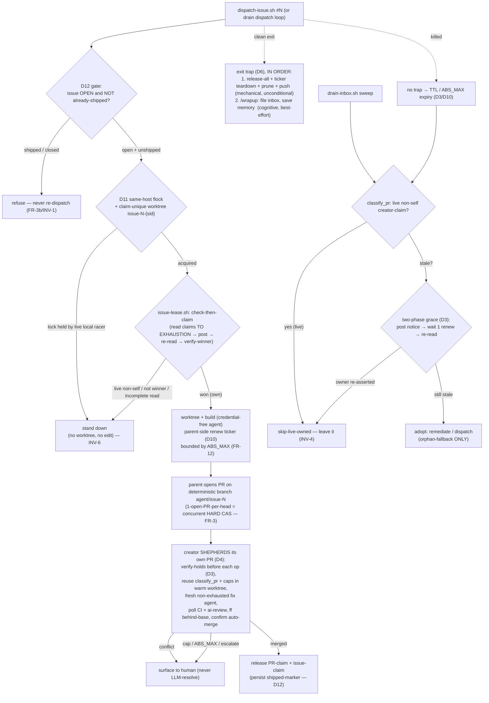

# MinSpec — Coordinated self-completing sessions (Plan)

**Reads:** [requirements.md](requirements.md) — the RCDD (#912 root cause), the four founder requests, the FRs, invariants, and the Clarify resolutions (OQ-1..4) are settled there and not re-litigated. This document is **HOW**, not WHAT/WHY. Materializes [DR-067](../../../docs/decisions/DR-067.md); governed by the constitution's [offline invariant #1](../../../.minspec/constitution.md#L5) and [enforce-it-via-code](../../../.minspec/constitution.md#L17).

## Approach

**One primitive, three consumers, no new subsystem and no new npm dependency.** The expiring lease already exists in `presence.ts` (SPEC-026); DR-065 gave it a *second* consumer (the sync gate). This spec gives it a **third** — the work-item claim — and restructures the pipeline around it:

1. **Claim before work.** Turn the unchecked, drain-only marker flip ([dispatch-issue.sh:218-221](../../../scripts/dispatch-issue.sh#L218)) into a real *check-then-claim* first step, gated by a **pure classifier seam** and won by the **SPEC-026 FR-13 arbitration key** lifted to the network.
2. **Correctness by CAS + persisted markers, dedup by optimism.** At-most-one-*merge* rests on hard guards, split by window: **concurrently** GitHub's **one-open-PR-per-head-branch** server CAS (the dispatch branch is deterministic, `agent/issue-N`); **sequentially** — since that CAS window closes when the merged head is deleted — an **open-issue + already-shipped-marker** gate before any re-claim (D12). Same-host double-build corruption (two racers, one deterministic worktree path) is closed by a per-item **`flock` + claim-unique worktree path** (D11), because the server CAS does not reach local FS. The soft claim is only a *dedup optimization* over the expensive build — never trusted for merge-correctness, so GitHub's lack of a formal read-after-write guarantee cannot threaten the invariant.
3. **Creator shepherds; drain reaps (with a grace handshake).** The session that opens a PR reuses `remediate-pr.sh`'s already-tested `classify_pr` + caps **in-process** to drive its own PR (reusing the warm worktree/branch + a fresh non-exhausted fix agent — not re-cloning, not re-deriving from a near-limit agent), and the drain becomes claim-aware: it touches a PR only when the creator-claim is absent/expired (`skip-live-owned`), and even then reclaims via a **two-phase grace-interval handshake** so a suspended-but-alive owner is not overridden (D3).
4. **Wrap up on the way out — release first, cognition after.** The parent `EXIT` trap runs **mechanical release-all + worktree-prune + push-committed first and unconditionally**, then attempts cognitive `/wrapup` best-effort (the live agent's last act on a clean exit only); a killed session's claim self-heals via TTL / absolute-lifetime expiry (D6). A parent-side **renew ticker**, launched at claim time and keyed to the agent PID, is torn down in the same trap (D10).
5. **Tier-0 split.** The lease *semantics* stay in the offline core (`presence.ts`); every networked consumer is Tier-1 `scripts/` (Phase 1) — with Phase-2 Execute-ext productization deferred as a cross-repo follow-up.

Four vertical slices; **Slice 1 (the lease seam + issue claim) first**, because Slices 2–4 all consume its predicate and its record shape.

## Key decisions

- **D1 — claim substrate: soft comment-order + THREE hard layers (Clarify OQ-1).** The soft claim is an append-only, server-ordered **claim comment** carrying `{sessionId, host, worktreeRoot, pid, claimedAt, lastRenewed}`; acquisition is *check → post → re-read → verify-winner*, where the verify-read must enumerate all competitors **to exhaustion** (partial/errored read ⇒ `stand-down` — INV-6). The costly outcomes rest on **hard** layers, not the soft claim: **(1) concurrent at-most-one-merge** = GitHub's one-open-PR-per-head-branch server CAS — the dispatch branch is deterministic (`agent/issue-N` — [dispatch-issue.sh:224](../../../scripts/dispatch-issue.sh#L224)), so two racers collapse to one PR while the head is open (FR-3/INV-1); **(2) sequential at-most-one-merge** = the D12 open-issue + shipped-marker gate (the CAS window closes when the merged head is deleted); **(3) same-host no-corruption** = the D11 per-item `flock` + claim-unique worktree path. Merge-correctness **never** depends on comment linearizability. The claim-ref CAS (`git push --force-with-lease=refs/minspec/claims/issue-N:` expecting-absent — a transactional create-if-not-exists at the git server) is the recorded **hardening** option for the soft layer if the rare double-*build* is judged too wasteful; it swaps in behind the same pure seam because only the *liveness* half is shared and the winner is substrate-local (D2).
- **D2 — winner function is SUBSTRATE-SPECIFIC; only LIVENESS is shared with presence.** Among *live* claim comments the winner is the earliest **server-ordered id** (GitHub's monotonic comment id — a server-assigned strict total order), with `sessionId` as a final deterministic tiebreak for the degenerate equal-id case. The client-clock `claimedAt` is **not** a deciding key (cross-machine skew-unsafe; carried only as metadata) — the monotonic server id decides, and being a strict total order it never leaves a tie for `claimedAt` to break. For the claim-*ref* substrate there is **no** tiebreak at all: `--force-with-lease` expecting-absent means at most one claim ref ever exists, so the git-server CAS *is* the winner. This is the *shape* of the SPEC-026 FR-13 tie-break (a monotonic primary → `sessionId`) but **not** byte-identical: presence keys on `startedAt` ([presence.ts:53](../../../packages/minspec/src/lib/presence.ts#L53)) and **exports no winner function**, so a cross-reader byte-parity of arbitration is impossible. What IS shared byte-for-byte is the **liveness** predicate (`isClaimLive` mirrors `isRecordLive`); the winner gets its own substrate-specific test (AC-9), the liveness gets the parity gate (D3/FR-10).
- **D3 — lease liveness = `isRecordLive` extended cross-machine by TTL, with a grace-interval reclaim (FR-8).** Same-machine: `lastRenewed` within TTL **and** `process.kill(pid,0)` alive ([presence.ts:86-91](../../../packages/minspec/src/lib/presence.ts#L86)). Foreign host: TTL **alone** (pid unobservable), degrading to the safe side — an un-renewed foreign claim expires and becomes reclaimable. This is the DR-065 foreign-record treatment applied to claims — and only the **liveness** half is mirrored byte-for-byte across the three readers (the parity gate, FR-10/AC-8). **The predicate can misjudge a suspended-but-alive owner as dead:** the bash reader checks `age < STALE` *before* `kill -0` ([drain-inbox.sh:196-197](../../../scripts/drain-inbox.sh#L196)), so a lapsed heartbeat alone marks reclaimable even same-machine (laptop sleep, renew-HTTP stalls, `SIGSTOP` — all unbounded). So reclamation is **two-phase**: the reaper posts "reclaiming in one renew interval unless renewed", waits **one renew interval**, re-reads, and **backs off** if the owner re-asserts; and the **owner re-verifies it still holds the claim before every credentialed op** (`issue-lease.sh verify-holds` gate before push/pr-create/arm-auto-merge/label-mirror) and stands down if reclaimed. The handshake, not TTL sizing, is the correctness bridge (no TTL bounds laptop sleep).
- **D4 — creator shepherds by REUSING the warm worktree + a fresh non-exhausted fix agent (not re-cloning, not a near-limit agent).** The creator still holds the **warm worktree + branch** (built state), so it drives its own PR by calling the same tested `classify_pr` ([remediate-pr.sh:71-95](../../../scripts/remediate-pr.sh#L71)) + attempt-cap machinery ([remediate-pr.sh:199-221](../../../scripts/remediate-pr.sh#L199)) and dispatching a **fresh fix agent that is not context-exhausted** — rather than the #912 fresh *drain* remediator that re-clones and starts near the context limit. Honest scope: the original build agent's in-context reasoning does **not** persist across invocations; the fix agent still re-reads the PR feedback + diff. What carries over is the *warm worktree/branch* (no re-clone, no rebuild) and a *non-exhausted* agent — that is the real #912 fix, not "holds the intent". No duplication of the remediation logic — one source of truth for "what is fixable," consumed by both the creator (owner path) and the drain (orphan path).
- **D5 — `skip-live-owned`: one new terminal token in `classify_pr` (FR-6/INV-4).** `classify_pr` gains a leading gate: if a **live, non-self** creator-claim exists for the PR, return `skip-live-owned`. The **drain** honours it (leaves the PR alone); the **creator** ignores it (it *is* the owner and drove here deliberately). The token is emitted by the pure classifier so it is unit-testable without `gh` (mirrors the existing `--classify` seam contract — [remediate-pr.sh:39-44](../../../scripts/remediate-pr.sh#L39)). Priority order: `skip-not-automation` → `skip-live-owned` → `skip-conflict` → `agent-remediate-checks` → `agent-remediate-review` → `rebase-only` → `skip-clean`.
- **D6 — auto-wrapup trap: MECHANICAL release first (unconditional), COGNITIVE wrapup after (clean-exit only) (FR-5).** Reuse `resolve_session_pid` ([drain-inbox.sh:258](../../../scripts/drain-inbox.sh#L258)) and `session_alive` ([drain-inbox.sh:134](../../../scripts/drain-inbox.sh#L134)) — the same PID the continuous drain already watches — for a parent `trap ... EXIT`. The trap runs, **in order**: (1) `issue-lease.sh release-all` + tear down the D10 renew ticker + prune merged worktrees/branches + push already-committed work — **first and unconditionally**, so a hung/erroring wrapup can never strand a lease (this fires even after the agent subprocess has exited); then (2) **best-effort** cognitive `/wrapup` (file `inbox` follow-ups, save memory), which — being an LLM/agent act needing the live agent — runs as the agent's **last act before** the trap on a **clean** exit, and is a no-op for a headless dispatch (no chat to save) and **impossible** on a kill. A killed parent fires **no** trap; its leases fall to the D3 TTL / D10 absolute-lifetime reaper (mechanical only). The push credential is the **parent's ambient** `gh`/git (Clarify OQ-3), so INV-5 (agent stays credential-free) is untouched.
- **D7 — Tier-0 split: name the primitive in core, keep every network op out (FR-7/INV-3).** `presence.ts` gains **documentation** naming its heartbeat/liveness as *the lease primitive*, and (optionally) exports the pure `isClaimLive(record, now, sameMachine)` predicate the Tier-1 readers mirror **byte-for-byte** (the parity gate). `pickClaimWinner(records)` may also be exported, but it is a **pure, substrate-specific** helper with its **own** test — **not** part of the byte-parity (presence has no winner counterpart; it keys on `startedAt`, the claim on `serverOrder`). The `sameMachine` argument is **decided by the caller** via a local `os.hostname()` syscall and passed in — core never resolves a host, so "same host?" never reaches for DNS/network. It imports only `fs/path/crypto/child_process(git,local)` and stays under the `tier0-import-ban` gate. All `gh`/network — and the local `flock`/worktree machinery — live in `scripts/lib/issue-lease.sh` + the callers, never in the ext.
- **D8 — `agent-running` stays a cosmetic mirror, never the authority (FR-9/DR-066).** The claim record is the source of truth; the label is updated *after* a successful claim purely for human visibility. No ownership decision ever reads the label (a single, overwritable, non-atomic producer — the exact "single disableable producer" DR-066 forbids for load-bearing signals).
- **D9 — the #912 autocompact circuit-breaker is retained as defence-in-depth, not removed.** Once the creator shepherds (no fresh near-limit remediator), the breaker ([drain-inbox.sh:425-468](../../../scripts/drain-inbox.sh#L425)) stops being load-bearing — but it stays as a belt-and-braces halt for any residual thrash path. Removing it is out of scope.
- **D10 — work-item TTL is a distinct paired constant, renewed build-independently by a PARENT-SIDE ticker, capped by an ABSOLUTE lifetime (Clarify OQ-2 + FR-12).** A named work-item lease TTL (paired as `TTL = k × RENEW`, mirroring `STALE = 4 × HEARTBEAT` — [presence.ts:32-33](../../../packages/minspec/src/lib/presence.ts#L32)) with a renew heartbeat on a wall-clock timer **independent of build progress**, so a long, quiet build never expires its own live claim. **The renew driver is parent-side, because the agent is credential-free** (it cannot call `issue-lease.sh renew`) and the parent is blocked on the agent subprocess: at claim time the parent launches a **background renew ticker** (a `( while sleep "$RENEW"; do issue-lease.sh renew … ; done ) &` subshell) keyed to the agent PID's lifetime, and **tears it down in the same `EXIT` trap** that releases the lease (D6) — so renewal is guaranteed regardless of build progress and cannot outlive the work. **But build-independent renew means a *hung* owner (live parent + live ticker, wedged build) would hold its claim forever** — so each claim also carries an **absolute max-lifetime** (`claimedAt + ABS_MAX`, ~2× expected-build-max, independent of renew): on expiry the owner **self-releases to `needs-human-review`**, or the drain **force-expires despite a live pid** (INV-2/FR-12). The FR-4 shepherd caps bound only the post-PR phase; `ABS_MAX` is what bounds the build phase. Constants are named once per language; only the *liveness* TTL is covered by the FR-10 parity test.
- **D11 — same-host hard mutual exclusion: per-item `flock` + claim-unique worktree path (FR-11/INV-7).** The server PR-per-head CAS gives **zero** protection against two racers on **one host** that derive the **same** deterministic worktree path (`${WORKTREE_BASE}/issue-N` — [dispatch-issue.sh:225](../../../scripts/dispatch-issue.sh#L225)) and both `git worktree remove --force` + `git branch -D` it ([dispatch-issue.sh:227-231](../../../scripts/dispatch-issue.sh#L227)) before any push — racer B clobbering racer A's **live** worktree mid-build. Two same-host guards, in `scripts/` (local `flock`/`fs` — no network): **(a)** the worktree path becomes **claim-unique** (`${WORKTREE_BASE}/issue-N-<sessionId>`), so no two racers share a directory (the pre-existing `if [[ -d "$WORKTREE" ]]; then git worktree remove --force` cleanup then only ever touches *this* session's own stale dir); **(b)** an OS-level **`flock -n`** on `.minspec/locks/issue-N.lock` — a genuine same-host CAS, auto-released on process death — is acquired before any worktree/branch mutation for the item; failing to acquire ⇒ another live local racer owns it ⇒ **stand down**. A worktree owned by a **live** claim is never force-removed by another racer. This is the per-item, auto-releasing counterpart to — **not** the rejected global singleton lock of DR-067 §Alternatives.
- **D12 — sequential re-merge guard: open-issue + already-shipped marker (FR-3b/INV-1).** The PR-per-head CAS is a guarantee only while the head/PR is **open**; once the first PR merges and `agent/issue-N` is deleted, `gh pr create` on a fresh `agent/issue-N` would succeed and re-merge the same change. So **before any (re-)claim or dispatch**, the parent verifies the item is **still open** *and* carries **no already-shipped marker** — checked in priority: (1) the issue is `state:OPEN`; (2) no persisted shipped-marker (the merged-PR number recorded on the issue on first merge — a `Shipped-by: #<pr>` issue comment/label, and/or a `Closes #N` merge-commit trailer). A stale drain cycle, reopened issue, or soft-claim miss that reaches a shipped item is **refused here**, before any build. This is the sequential half of INV-1 that PR-per-head cannot cover.

## Architecture



Before this change, `dispatch-issue.sh` flipped `agent-ready → agent-running` with no check ([:218-221](../../../scripts/dispatch-issue.sh#L218)) and **exited** after opening the PR ([:422-464](../../../scripts/dispatch-issue.sh#L422)), handing every PR to a fresh drain remediator ([drain-inbox.sh:471-496](../../../scripts/drain-inbox.sh#L471)) that re-derived intent (the #912 mechanism). After: the first step is a claim, the creator shepherds, and the drain only reaps orphans.

## API / Contracts

```bash
# scripts/lib/issue-lease.sh — the claim protocol. PURE seam (no gh/git/claude) +
# gh-backed ops. Mirrors remediate-pr.sh's --classify contract (a tested pure core
# behind a thin credentialed shell).

# PURE seam — safe to unit-test in isolation (no network):
#   issue-lease.sh --classify-claim <claims_json> <self_session_id> <now_epoch> <enum_complete:0|1>
#     claims_json: array of {sessionId,host,worktreeRoot,pid,claimedAt,lastRenewed,serverOrder}
#     enum_complete: 0 iff the credentialed read could NOT prove it enumerated ALL claims
#                    (paginated-short/rate-limited/errored) — forces stand-down (INV-6)
#     → prints ONE decision token: own | stand-down | claim
#       own        = self holds the earliest LIVE claim AND enum_complete=1 (proceed)
#       stand-down = a live, non-self claim wins, OR enum_complete=0 (defer — INV-6)
#       claim      = no live claim, enum_complete=1 (self may acquire, then re-verify)
#     + on a second line: the winning sessionId
#     WINNER = earliest serverOrder → sessionId (D2). claimedAt is METADATA, never a key.
#
#   issue-lease.sh --is-live <lastRenewed> <claimedAt> <pid> <host> <self_host> <now_epoch>
#     → exit 0 iff live (TTL fresh AND (foreign-host OR pid alive)) AND (claimedAt+ABS_MAX not passed)
#       — the liveness half mirrors presence.ts isRecordLive byte-for-byte (D3); the ABS_MAX
#         ceiling (FR-12) is claim-specific and NOT part of the presence parity set

# CREDENTIALED ops (parent-side only; the agent never calls these — INV-5):
#   issue-lease.sh acquire     <issue|pr-N>  # flock (D11) → gate open+unshipped (D12) → post claim,
#                                            #   re-read TO EXHAUSTION, verify winner; exit 1 if lost/incomplete
#   issue-lease.sh renew       <issue|pr-N>  # refresh lastRenewed (parent-side ticker, D10)
#   issue-lease.sh verify-holds <issue|pr-N> # exit 0 iff self STILL holds the live claim —
#                                            #   called before EVERY credentialed op (D3 re-verify)
#   issue-lease.sh release     <issue|pr-N>  # retract this session's claim on clean completion
#   issue-lease.sh release-all               # release every claim held by this session (exit-trap, FR-5)
#   issue-lease.sh reclaim?    <issue|pr-N>  # drain orphan gate: exit 0 iff claim absent/expired.
#                                            #   TWO-PHASE (D3): if stale, post grace-notice, wait one
#                                            #   RENEW, re-read, back off if owner re-asserted
#   issue-lease.sh worktree-path <issue|pr-N> # echo the claim-unique path ${BASE}/issue-N-<sid> (D11)
```

```bash
# scripts/remediate-pr.sh — classify_pr gains ONE terminal token (D5). Signature and
# the other tokens are UNCHANGED; a new leading owner-gate is added.
#   classify_pr <branch> <mergeable> <mergeStateStatus> <labels_csv> \
#               <failing_non_review> <ai_review_bad> <live_nonself_claim:yes|no>
#     → skip-not-automation | skip-live-owned | skip-conflict |
#       agent-remediate-checks | agent-remediate-review | rebase-only | skip-clean
```

```ts
// packages/minspec/src/lib/presence.ts — Tier-0, offline, NO network (D7/INV-3).
// OPTIONAL extraction. `sameMachine` is decided by the CALLER (a local os.hostname()
// syscall) and passed in — core never resolves a host (no DNS/net for "same host?").
/** A work-item claim is live iff its heartbeat is within TTL AND (foreign-host OR pid alive).
 *  This is the ONE predicate the Tier-1 bash readers mirror byte-for-byte (parity gate, FR-10). */
export function isClaimLive(c: WorkItemClaim, now: number, sameMachine: boolean): boolean;
/** Deterministic winner among live claims: earliest serverOrder → sessionId (claimedAt is NOT
 *  a key). SUBSTRATE-SPECIFIC and pure; has its OWN test (AC-9) — deliberately NOT in the
 *  byte-parity set, since presence exports no winner and keys arbitration on startedAt (D2). */
export function pickClaimWinner(claims: WorkItemClaim[], now: number): WorkItemClaim | null;
```

The existing `presence.ts` runtime surface (`SessionPresenceManager`, `isRecordLive`, `isCheckoutOccupied`) is **unchanged**; this spec adds documentation + the optional pure predicate(s). `remediate-pr.sh`'s existing tokens, caps, and egress/credential model are unchanged. The `ABS_MAX` ceiling and the two-phase grace reclaim live in `issue-lease.sh` (Tier-1), not in core.

## Slice plan (files touched)

**Slice 1 — the lease seam + issue check-then-claim + same-host hard lock (FR-1, FR-2, FR-3, FR-3b, FR-7, FR-8, FR-9, FR-11, INV-1, INV-2, INV-6, INV-7).**
- `scripts/lib/issue-lease.sh` (**new**) — the `--classify-claim` (with the `enum_complete` flag, D1/INV-6) / `--is-live` (with the `ABS_MAX` ceiling, D10) pure seam (D1/D2/D3) + `acquire/renew/verify-holds/release/release-all/reclaim?/worktree-path` credentialed ops, including the per-item `flock` (D11), the open-issue+shipped-marker gate (D12), and the two-phase grace reclaim (D3). Named work-item TTL/RENEW/ABS_MAX constants (D10) with a tie-back comment to `presence.ts` (only the liveness TTL is parity-shared).
- `scripts/dispatch-issue.sh` — insert the check-then-claim **first step** before `git worktree add` ([~:223-250](../../../scripts/dispatch-issue.sh#L223)): take the `flock`, gate on open+unshipped (D12), and switch the worktree path from the shared `issue-N` to the claim-unique `issue-N-<sessionId>` (D11 — so the existing `git worktree remove --force` cleanup at [:227-231](../../../scripts/dispatch-issue.sh#L227) only ever touches this session's own dir); `stand-down` exits cleanly without a worktree. Update the `agent-running` label flip ([:218-221](../../../scripts/dispatch-issue.sh#L218)) to happen **after** a won claim, as a mirror only (D8).
- `packages/minspec/src/lib/presence.ts` — documentation naming the lease primitive; optional `isClaimLive` (parity-shared) + `pickClaimWinner` (own test) export (D7). No network, no behaviour change to existing exports.

**Slice 2 — creator-owned PR shepherding (FR-4, FR-12, INV-5).**
- `scripts/dispatch-issue.sh` — after opening the PR ([:422-464](../../../scripts/dispatch-issue.sh#L422)): acquire the PR-claim, start the parent-side renew ticker (D10), then a bounded shepherd loop that reuses `remediate-pr.sh`'s `classify_pr` + caps in-process (D4) — each credentialed step preceded by `verify-holds` (D3); the build phase is bounded by `ABS_MAX` (D10/FR-12); conflicts surfaced, `ai-review:*` labels untouched (INV-5), the credential-free agent unchanged.

**Slice 3 — drain demoted to orphan-fallback (FR-6, INV-4).**
- `scripts/remediate-pr.sh` — add the `skip-live-owned` owner-gate to `classify_pr` (D5) + the extra positional; derive `live_nonself_claim` from `issue-lease.sh reclaim?` (which applies the two-phase grace handshake, D3).
- `scripts/drain-inbox.sh` — the dispatch loop ([:441-469](../../../scripts/drain-inbox.sh#L441)) claims-checks each `agent-ready` issue (adopt only unclaimed/expired, via the grace handshake); the PR sweep ([:471-496](../../../scripts/drain-inbox.sh#L471)) passes the owner-claim state so `skip-live-owned` PRs are left alone; add the expired-lease reaper (incl. `ABS_MAX` force-expiry of a live-but-hung owner).

**Slice 4 — auto-wrapup on exit (FR-5).**
- `scripts/drain-inbox.sh` + `scripts/dispatch-issue.sh` — a `trap … EXIT` on the parent that runs, **in order**, (1) `issue-lease.sh release-all` + renew-ticker teardown + worktree-prune + push-committed **first and unconditionally**, then (2) best-effort cognitive `/wrapup` (clean exit only), keyed on `resolve_session_pid`/`session_alive` (D6); parent-side credential (OQ-3).

## Dependency budget

**0 new npm dependencies; 1 new script lib** (`scripts/lib/issue-lease.sh`). Everything else reuses in-repo primitives — `presence.ts` liveness, `remediate-pr.sh`'s `classify_pr`/caps, `drain-inbox.sh`'s `resolve_session_pid`/`session_alive`, `gh`, and the OS-native `flock`/`os.hostname` (no new dep). Within CLAUDE.md's budget (0–1 for the offline core; the Tier-1 machinery is a single new seam consumed by three existing scripts).

## Test strategy (tiers)

Bash pure seams (`--classify-claim`, `--is-live`, `classify_pr`) are unit-tested via the existing `--classify`-style harness; the TS predicate + parity live in `packages/minspec/tests/`. Existing `presence*` and `remediate*`/`drain*` tests must stay green.

- **T0 (invariants, before implementation):**
  - **INV-1** — the pure winner function yields **exactly one** `own` across N racers on a fixture; a forced two-builder scenario collapses to one PR **within the concurrent window** (AC-2), and a **shipped** item (closed issue / shipped-marker) is refused re-dispatch (AC-2b, the sequential guard D12).
  - **INV-2 / FR-8 / FR-12** — a claim reads live before TTL and reclaimable after (stale heartbeat, or same-machine dead pid); a foreign-host claim reclaims on TTL alone (AC-3); a **live-but-hung** owner past `ABS_MAX` is force-expired despite a live pid (AC-3c).
  - **INV-3** — `presence.ts` reaches no network; `tier0-import-ban` stays green; a bundle grep finds no claim/poll/merge/push in the ext (AC-7). `sameMachine` is a passed-in param (local `os.hostname()`), never a host resolution in core.
  - **INV-6** — an unreadable/inconsistent claim record ⇒ `stand-down`; **an incomplete/truncated/errored enumeration (`enum_complete=0`) ⇒ `stand-down`** (a loser cannot compute a false `own`); reclamation only on positive expiry.
  - **INV-7 / FR-11** — two same-host racers take distinct claim-unique worktree paths and the per-item `flock` serialises them; neither force-removes the other's **live** worktree (AC-11; **red** on the pre-fix shared `issue-N` path).
  - **FR-10** — the **liveness** predicate agrees byte-for-byte across `presence.ts`, the drain bash reader, and `issue-lease.sh` on the golden fixtures (the DR-065 §4 parity test, **extended** — AC-8). The winner function is tested separately (AC-9), not in this parity set.
- **T1 (contract):**
  - `issue-lease.sh --classify-claim` truth table: {no claim, live self, live non-self, stale non-self + live self, equal-`serverOrder` degenerate → `sessionId` break, foreign-host live, `enum_complete=0` → `stand-down`} → `own`/`stand-down`/`claim` + winner id (AC-9). Winner keys on `serverOrder → sessionId`; `claimedAt` is asserted to **never** change the outcome.
  - `classify_pr` with the new `live_nonself_claim` arg: {live non-self ⇒ `skip-live-owned`, absent/expired ⇒ prior token} across every pre-existing branch/state combination (regression-guards the unchanged tokens).
- **T2 (feature, per slice):** AC-1 (concurrent dispatch stand-down; **red on pre-fix** — no check), AC-2b (sequential re-merge refused), AC-3b (grace interval protects a suspended-but-alive owner; **red on one-phase reclaim**), AC-4 (creator shepherds its own PR; labels untouched; conflict surfaced; cap → human; build past `ABS_MAX` → human), AC-5 (`skip-live-owned` honoured by drain, adopted when orphaned), AC-6 (**ordering**: mechanical release fires first even when cognitive `/wrapup` is injected to hang/fail; killed session leaves the claim to expiry), AC-11 (same-host racers never share a worktree).
- **T3 (regression):**
  - **The #912 regression** — with a live creator-claim present, the drain's PR sweep dispatches **no** remediator for that PR (no re-derivation, no fresh near-limit agent); once the claim expires (via the grace handshake), the drain adopts it. Asserts **red** on pre-fix (drain remediates every open PR unconditionally).
  - **At-most-one-merge under a forced soft-claim race** (AC-2) — two builders, one PR, one merge (the hard PR-per-head CAS); plus **sequential** (AC-2b) — a merged item is not re-merged.
  - Plus one T3 per bug found during implement.

## Risks

Inherits requirements R1 (soft-claim linearizability — correctness rests on the hard PR-per-head CAS, D1/FR-3; hardening = claim-ref CAS), R2 (TTL vs build duration — distinct work-item TTL + build-independent renew, D10), R3 (three-reader **liveness** drift — paired constants + the extended parity gate, FR-10/AC-8; the winner is substrate-specific with its own test), R4 (hung shepherd *and* hung build — bounded post-PR caps + the `ABS_MAX` build-phase ceiling, D10/FR-12), R5 (demoting the drain strands PRs — orphan-fallback reaper + mechanical-release-first in the exit trap + the retained #912 breaker, D6/D9), R6 (cross-machine crashed owner — TTL-bounded, fails safe), **R7** (same-host double-build corruption — per-item `flock` + claim-unique worktree path, D11/INV-7), **R8** (sequential double-merge — open-issue + shipped-marker gate, D12/FR-3b), **R9** (suspended-but-alive owner reclaimed on a lapsed heartbeat — two-phase grace reclaim + owner re-verify, D3/FR-8), **R10** (incomplete claim enumeration → false `own` — provably-complete read or `stand-down`, INV-6/FR-2). The change stays **additive** (a new seam + one classifier token + a same-host lock layer + a sequential gate + a trap), reuses the tested `classify_pr`/presence liveness, and leaves the credential model, the `ai-review:*` provenance, and the merge-conflict-to-human rule unchanged — but it is no longer claimed that "no new risks" arise: R7–R10 are failure modes the original draft under-covered, now surfaced with mitigations and red-before-green ACs.
</content>
