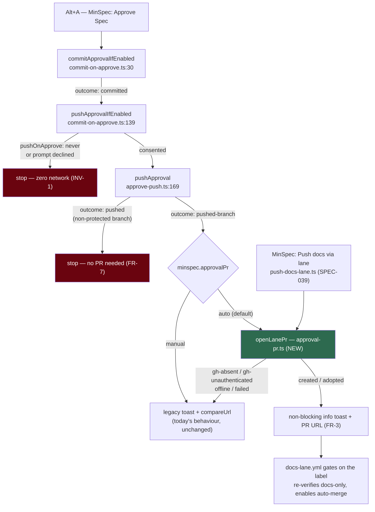

# SPEC-050 — Design

> Plan for [requirements.md](requirements.md). Every `file:line` below was read on
> 2026-07-31 against `main` at `2e1ef34`; where the requirements' own line numbers have
> drifted since Specify, the numbers here supersede them.

## Approach in one paragraph

The approval flow already pushes and already stops one step short. `pushApprovalIfEnabled`
([commit-on-approve.ts:139](../../../packages/minspec/src/commands/commit-on-approve.ts#L139))
gets `outcome: 'pushed-branch'` back from `pushApproval`
([approve-push.ts:146-151](../../../packages/minspec/src/lib/approve-push.ts#L146)) and hands
the user a browser link ([commit-on-approve.ts:171-186](../../../packages/minspec/src/commands/commit-on-approve.ts#L171)).
Meanwhile SPEC-039's command already knows how to open a labelled lane PR
([push-docs-lane.ts:398-427](../../../packages/minspec/src/commands/push-docs-lane.ts#L398)).
So this spec **moves no logic and invents no protocol**: it lifts the PR-opening tail of
`push-docs-lane.ts` into a vscode-free lib, makes SPEC-039's command its first caller with
zero behaviour change (Slice 1 — the seam), then calls the same seam from the
`'pushed-branch'` arm (Slice 2 — auto-open on approve).

The one genuinely new decision is **what the seam is allowed to know**: it takes a branch,
a title, a body and a label list, and returns a typed outcome. It never reads settings,
never toasts, and never touches the approval store — so both callers keep their own
surfaces and INV-4 is structural rather than promised.

## Architecture



The green node is the only new module. The two red nodes are the paths that must remain
provably inert (AC-6, AC-7).

## Modules

### `packages/minspec/src/lib/approval-pr.ts` — NEW, owned here

**Tier-0-shaped: no `vscode` import.** It may spawn `git`/`gh` (so it is not offline-pure),
but it takes no settings and raises no UI, which is what makes both callers testable against
a stub runner.

Moved verbatim out of `push-docs-lane.ts` (no logic change, only relocation + export):

| Symbol | Currently at | Why it moves |
|---|---|---|
| `ExecRun`, `defaultExecRun` | [:85-112](../../../packages/minspec/src/commands/push-docs-lane.ts#L85) | the bounded `git`/`gh` runner both callers need |
| `isEnoent`, `describeError` | [:114-128](../../../packages/minspec/src/commands/push-docs-lane.ts#L114) | error classification is shared |
| `isNetworkError`, `isAuthError` | [:130-142](../../../packages/minspec/src/commands/push-docs-lane.ts#L130) | the `offline` / `gh-unauthenticated` split (FR-5) |
| `slugFromOriginUrl` | [:186-192](../../../packages/minspec/src/commands/push-docs-lane.ts#L186) | already exported; just relocates |

New surface:

```ts
export type LanePrOutcome =
  | 'created'            // a new PR was opened (prUrl set)
  | 'adopted'            // an open PR already existed for this branch (FR-6) — its URL returned
  | 'not-docs-only'      // a path fell outside the lane allowlist — PR opened UNLABELLED (INV-2)
  | 'gh-absent'          // `gh` is not installed (ENOENT)
  | 'gh-unauthenticated' // installed but not logged in
  | 'offline'            // a network step could not reach GitHub
  | 'failed';            // any other gh error

export interface LanePrResult {
  readonly outcome: LanePrOutcome;
  readonly prUrl?: string;      // present on 'created' | 'adopted' | 'not-docs-only'
  readonly labelled?: boolean;  // whether `docs-lane` was applied
  readonly error?: string;
}

export interface OpenLanePrInput {
  readonly cwd: string;               // repo root or worktree — where gh runs
  readonly branch: string;            // head branch, already pushed by the caller
  readonly base?: string;             // default 'main'
  readonly title: string;
  readonly body: string;
  readonly paths: readonly string[];  // changed paths, for the INV-2 allowlist check
  readonly slug?: string;             // owner/repo when parseable; else gh infers
}

export async function openLanePr(input: OpenLanePrInput, run: ExecRun): Promise<LanePrResult>;
```

`openLanePr` does, in order: `gh auth status` pre-flight (so a missing/unauthenticated CLI
fails before any mutation, as [:306-313](../../../packages/minspec/src/commands/push-docs-lane.ts#L306)
already does) → `input.paths.every(isDocsCorpusPath)` to decide the label (INV-2) →
`gh pr create` → on a "already exists" rejection, `gh pr list --head <branch> --state open
--json url` to adopt (FR-6).

### `packages/minspec/src/commands/push-docs-lane.ts` — modified, NOT owned here

Keeps everything that is genuinely its own: folder resolution, the docs-corpus status scan,
the modal consent gate, the temp worktree, the copy/`git rm`/commit/push, and its `surface()`
toasts. Its PR-creation block ([:398-429](../../../packages/minspec/src/commands/push-docs-lane.ts#L398))
becomes one `openLanePr` call. `PushDocsOutcome` is unchanged — the mapping is total:
`created`/`adopted`/`not-docs-only` → `pushed`, and the four failure outcomes pass through
by the same name. **AC-10 is the gate: its existing tests must pass untouched.**

### `packages/minspec/src/commands/commit-on-approve.ts` — modified, owned here

Two changes.

**1. The `'pushed-branch'` arm (Slice 2).** Today it toasts and returns
([:171-186](../../../packages/minspec/src/commands/commit-on-approve.ts#L171)). It gains an
`approvalPr` branch: `manual` → exactly today's code path; `auto` → `openLanePr`, then a
non-blocking info toast carrying the URL (FR-3), with every failure outcome falling back to
the identical legacy toast plus a reason (FR-5).

**2. `pushApprovalIfEnabled` gains the committed paths.** It is called with
`(rootDir, slug)` today; the PR body needs the approval record and the changed paths need
checking against the allowlist. `commitApprovalIfEnabled` already holds both —
`CommitApprovalResult.paths` is declared at
[approve-commit.ts:81](../../../packages/minspec/src/lib/approve-commit.ts#L81) and populated
on the `'committed'` return at
[approve-commit.ts:246](../../../packages/minspec/src/lib/approve-commit.ts#L246).
So the signature becomes `(rootDir, slug, paths: readonly string[])`. No new plumbing, no new
state: the caller passes what it already computed.

### `packages/minspec/src/lib/approval-pr-body.ts` — NEW, pure

PURE and separately testable, so OQ-2's provenance block is asserted without a runner:

```ts
export function buildApprovalPrBody(input: {
  readonly record: ApprovalRecord;   // read from the sidecar — NEVER written (INV-4)
  readonly commitSha: string;
  readonly files: readonly string[];
}): string;
```

Reads `specPath`, `specHash`, `approvedAt`, `approvedBy`, `tier` from
[`ApprovalRecord`](../../../packages/minspec/src/lib/approval.ts#L55). Presentation only —
the sidecar stays authoritative, and this never makes the body a source of truth.

### `packages/minspec/package.json` — modified, NOT owned here

```jsonc
"minspec.approvalPr": {
  "type": "string",
  "enum": ["auto", "manual"],
  "default": "auto",
  "scope": "window",
  "enumDescriptions": [
    "Open the docs-lane pull request automatically after an approval is pushed to a side branch.",
    "Show a notification with an 'Open PR' link instead, and let you create the PR yourself."
  ]
}
```

## FR-8 — the one-time standing-consent offer

The `prompt` notification at
[commit-on-approve.ts:146-155](../../../packages/minspec/src/commands/commit-on-approve.ts#L146)
gains a third action, **"Always push from now on"**, beside `Push` / `Not now`. On click:

1. `vscode.workspace.getConfiguration('minspec').update('pushOnApprove', 'always', ConfigurationTarget.Global)` — the **user's own** settings, never the workspace file (DR-071's corollary);
2. proceed with the push for this approval, so the click is not also a decline.

**Shown once, then never again.** Reuses the #883 model already built in
[`auto-bootstrap.ts`](../../../packages/minspec/src/lib/auto-bootstrap.ts) —
`loadPreferences` (`:82`), `savePreferences` (`:101`), and the `answeredSignatures` map
(`:68`) — recording the offer under its own `skipPrefKey`. `package.json`'s contributed
default **stays `prompt`** (DR-071 condition 1).

> ⚠️ **Note for whoever implements this.** `auto-bootstrap.ts` contains two raw NUL bytes at
> line 223, so plain `grep` silently skips the whole file and it looks empty — use `grep -a`.
> Filed as [#1266](https://github.com/AIClarityAU/minspec/issues/1266); it does not block this
> spec, and the preference API itself is fine.

## Key decisions

- **The seam is a lib, not a command.** `approval-pr.ts` lives under `src/lib/` and imports no `vscode`. Both callers keep their own toasts. This is what makes AC-3, AC-7, AC-8 and AC-9 assertable on the *recorded runner argv* rather than by inspection.
- **`not-docs-only` opens the PR unlabelled rather than refusing.** The branch is already pushed by the time the seam runs, so refusing would strand it — the exact failure family this spec exists to end. AC-2 requires only that it is never *labelled*; the lane workflow independently re-verifies and refuses loudly anyway ([docs-lane.yml:52-54](../../../.github/workflows/docs-lane.yml#L52)), so this is two checks, not a weakened one.

  **An unlabelled PR must SAY it is unlabelled (AC-11 below).** Without the label the lane never runs, so the PR sits open forever with no auto-merge and no signal — silence that looks exactly like success. Opening it unlabelled is only safe *because* the user is told; the two are one decision, not a decision plus a nicety.
- **Idempotency by create-then-adopt, not list-then-create.** `approvalBranchName` stamps to the millisecond ([approve-push.ts:128-138](../../../packages/minspec/src/lib/approve-push.ts#L128)), so a collision is rare; paying an extra `gh pr list` round-trip on every approval to handle it would tax the common path. Adopt on the "already exists" rejection instead — one call when it works, two only when it must be.
- **The title mirrors the commit subject** (FR-2), so the PR and the commit are greppable by one string.
- **`pushed` is untouched** (FR-7): the PR exists only because a protected branch refused a direct push.

## Dependency budget

**Zero new dependencies.** Everything is `child_process` + `gh`, both already in use.

## Test plan

T0/T1 first, all against a stub `ExecRun` recording every `(file, args, cwd)`:

| Test | Covers |
|---|---|
| `approval-pr.test.ts` — outcome matrix over stub responses | AC-4, FR-5, FR-6 |
| `approval-pr.test.ts` — argv assertions: no `checkout`/`switch`/`merge`/`rebase`/`reset` ever recorded | AC-8, INV-3 |
| `approval-pr.test.ts` — a non-allowlisted path yields `labelled: false` | AC-2, INV-2 |
| `commit-on-approve` — a `not-docs-only` outcome surfaces a notification saying auto-merge will not run, and never the silent success surface | AC-11 |
| `approval-pr-body.test.ts` — pure body-shape assertions | OQ-2 |
| `commit-on-approve` — `auto` creates, `manual` does not | AC-1 |
| `commit-on-approve` — `pushOnApprove: never`, and `prompt` declined, record **zero** runner calls | AC-7, INV-1 |
| `commit-on-approve` — `outcome: 'pushed'` runs no `gh` | AC-6 |
| `commit-on-approve` — no write under `.minspec/approvals/**`, no `status:` line, on any path | AC-9, INV-4 |
| `push-docs-lane.test.ts` — **unchanged**, must pass | AC-10, R3 |

AC-3 is asserted structurally: the success path must have `prUrl` populated *before* any
`showInformationMessage` promise is awaited, so no future edit can make a click load-bearing.

## Out of scope for this design

Everything in the requirements' *Out of scope*, unchanged. Additionally: **#1266** (the NUL
bytes) is noted above only because it obstructs reading `auto-bootstrap.ts`; fixing it belongs
to that issue.
