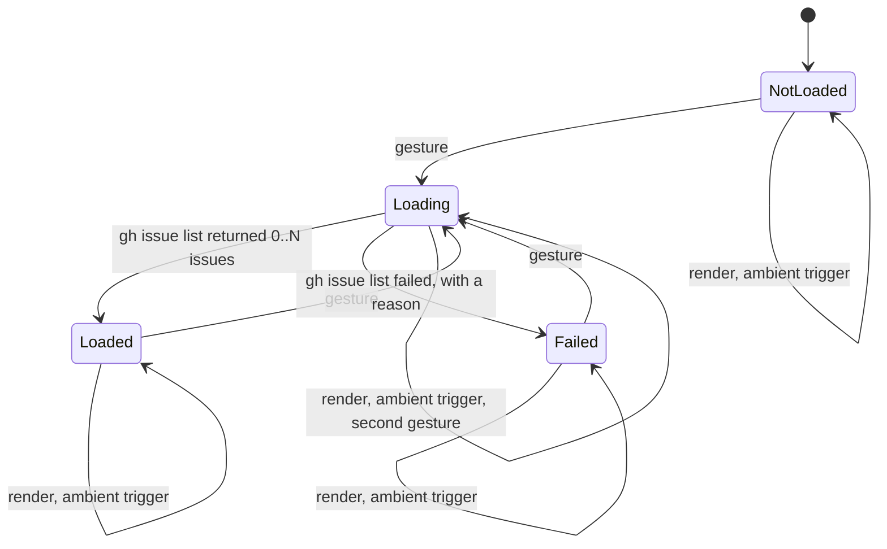

# SPEC-085 - Design: the Backlog panel contacts GitHub only on a gesture

Plan for [requirements.md](requirements.md), built under the five recorded Clarify selections
(Option A for DQ-1 to DQ-5). Citations of "today" are against `origin/main` 5f679727, the
commit this plan was written on. New code is cited by symbol, because its line numbers move.

## Approach in one paragraph

Today the fetch lives inside the render: VS Code asks the provider for its children and the
provider answers by running `gh`. This plan moves the fetch out of the render entirely. The
provider holds one of four states and `getChildren()` only draws the state it holds, so no
render, re-render or ambient trigger can start a process, by construction rather than by a
check that could be skipped. Exactly one call starts a process: the provider's `refresh`
when it is handed `{ contactGitHub: true }`, and exactly one call site passes that, the
`minspec.refreshBacklog` registration. The failure handling is not designed here: it is the
unmerged #2247 fix, adopted as its own commit per DQ-5.

## What Plan found that the spec did not know

Six facts, each checked against the code, that change how the requirements are met. None
changes a requirement.

1. **#2247 has not merged, so its commit is adopted (DQ-5).** Issue #2247 is open and no
   pull request exists, in any state, for head `agent/issue-2247` (checked 2026-10-02; a
   control query on `spec/2329-backlog-consent` returned #2358, so the empty answer is
   real). DQ-5 says Plan then adopts that branch's commit. `460166a8` applies cleanly to
   5f679727: none of its six files changed on `main` since its base. It is cherry-picked
   unmodified as its own commit. Two of its six files are tests the spec's `affects:` does
   not list, `packages/minspec/tests/backlog-async.test.ts` and
   `packages/minspec/tests/commands.test.ts`; the first is forced (four tests there depend
   on the swallow the fix removes), the second carries the two FR-6 command tests. This
   change makes no edit of its own to either file.

2. **The provider's method names are pinned by two suites this spec does not own.**
   `packages/minspec/tests/extension.test.ts:16` and
   `packages/minspec/tests/extension-extra.test.ts:30` replace the provider with a mock that
   has `refresh`, `refreshIfStale` and `setExpansionMemory` and nothing else, and assert
   that Refresh Backlog calls `refresh` (`extension.test.ts:531-537`), that visibility and
   focus call `refreshIfStale` (`:619-626`, `:640-649`; the visibility test also asserts
   `refresh` is not called), and that the
   three sibling commands and the epic toggle call `refresh`
   (`extension-extra.test.ts:753`, `:763`, `:773`, `:916-924`). A separately named gesture
   method would throw against that mock. So the gesture is expressed as an argument on the
   existing method (see Contracts), both suites pass unedited, and they keep proving that
   each trigger calls the method it called before.

3. **There is a fifth caller of `refresh()` the spec's list omits.** The spec lists three
   ambient triggers and three sibling commands. `minspec.backlog.toggleEpicGrouping` is a
   seventh route: it runs `t.provider.refresh()` through the shared toggle helper
   (`packages/minspec/src/extension.ts:209`, registered at `:419`). Today that clears the
   list and refetches. Under this plan it re-renders the loaded list with the new grouping,
   which is what a grouping toggle should do, and it is covered by the same rule as the
   sibling commands (FR-4).

4. **Merging this change publishes the site card.** The spec's DQ-3 and "Out of Scope" say
   the live site changes only when someone deploys it, as a separate human act.
   `.github/workflows/deploy-sites.yml` deploys the site to Cloudflare Pages on every push
   to `main` that changes a file under `sites/`. The separate human act is therefore the
   merge itself, which is why
   `scripts/auto-merge-gate.ts:802-839` keeps every path under `sites/` out of automatic
   merging (#981). Nothing in this plan deploys anything; the person who merges should know
   the card goes live when they do.

5. **The README moved under the spec.** #2396 rewrote the listing after the spec's line
   numbers were taken. The same sentences are now at `packages/minspec/README.md:31`,
   `:33-39`, `:331` and `:353`. The walkthrough line (`:27`) and the site line (`:1164`) did
   not move.

6. **`child_process` is not the only way this code starts a process.**
   `packages/minspec/src/commands/init.ts:256` loads `simple-git`, which runs `git` on its
   behalf, and is not in `CHILD_PROCESS_ALLOWLIST` because the allowlist test looks for a
   `child_process` import. What it runs is local (`rev-parse`, `check-ignore`, `add`,
   `commit`, `checkout -b`, `status`). FR-9's inventory is therefore widened to every module
   that loads either library, so the README's list rests on a test that sees both routes.
   The gap in the allowlist test itself is #2456.

## Architecture



The only transitions that start a process are the three labelled `gesture`. Every other
edge is a self-loop that draws what is already held. A gesture that arrives while one is in
flight joins it: one gesture in flight is one process.

Who may start a process, after this change:

| Caller | May start `gh`? | Why |
|---|---|---|
| `BacklogTreeProvider.getChildren` | No | Draws the held state. It has no call that reaches `lib/backlog.ts`'s process functions |
| `BacklogTreeProvider.refresh()` with no argument | No | Fires the change event |
| `BacklogTreeProvider.refreshIfStale()` | No | The same, at most once per 30 seconds |
| `BacklogTreeProvider.refresh({ contactGitHub: true })` | Yes, one `gh issue list` | The gesture (FR-2) |
| `scoreWsjfCommand`, `triageIssueCommand` | Yes | Commands the user invokes (FR-6), unchanged in when they run |

The panel no longer calls `isGhAvailable` at all (DQ-2). After a gesture the single
`gh issue list` is the probe: #2247's classifier turns a missing binary or a signed-out CLI
into a reason on the could-not-load row.

## Contracts

```ts
/** Options for BacklogTreeProvider.refresh. */
export interface BacklogRefreshOptions {
  /**
   * true ONLY for the Backlog gesture (SPEC-085 FR-2). Authorises one `gh issue list`.
   * Omitted by every other caller, which gets a re-render from memory.
   */
  readonly contactGitHub?: boolean;
}

/** What the panel holds. `getChildren` draws exactly this and nothing else. */
type BacklogLoadState =
  | { readonly kind: 'not-loaded' }
  | { readonly kind: 'loading' }
  | { readonly kind: 'loaded'; readonly issues: BacklogIssue[]; readonly loadedAt: Date }
  | { readonly kind: 'failed'; readonly reason: string };

class BacklogTreeProvider {
  /** Re-render, or with { contactGitHub: true } run the one fetch a gesture authorised. */
  refresh(options?: BacklogRefreshOptions): Promise<void>;
  /** Re-render unless one was requested within maxAgeMs. Never fetches. */
  refreshIfStale(maxAgeMs?: number): void;
  /** Draw the held state. Starts no process. */
  getChildren(element?: BacklogNode): Promise<BacklogNode[]>;
}

/** 'YYYY-MM-DD HH:MM' in local time. No locale, so it reads the same everywhere. */
export function formatLoadedAt(when: Date): string;
```

`refresh` returns a promise so a caller can wait for a gesture's fetch; it resolves at once
for a re-render and never rejects, because a failed fetch becomes the `failed` state. The
command handler does not wait for it: `minspec.refreshBacklog` returns immediately, as it
does today, and the tree updates when the fetch settles. Waiting would tie the command's
duration to `gh`'s 15 second timeout, and the end-to-end suite runs this command twice
under a 20 second limit (`packages/minspec/.vscode-test.mjs:7`).

Rows, one per state. `contextValue` is what tells them apart in code and in tests:

| State | `contextValue` | Label | Description | Activating the row |
|---|---|---|---|---|
| not loaded | `backlogNotLoaded` | Backlog not loaded | Select to list this repository's issues from GitHub using your gh CLI | runs `minspec.refreshBacklog` |
| loading | `backlogLoading` | Loading issues from GitHub... | | nothing |
| loaded, N issues | `backlogLoadedAt`, then the groups | Loaded 2026-10-02 14:02 | not refreshed automatically | nothing |
| loaded, zero issues | `backlogLoadedAt`, then `backlogEmpty` | No open issues found | | nothing |
| could not load | `backlogFailed` | Could not load issues: (the reason) | | nothing |

Only the not-loaded row carries a command, because FR-2 names exactly two gestures. A user
looking at the could-not-load row retries from the view-title button or the palette, and
the row's tooltip says so.

## UX

Not loaded. One row; the title-bar button's tooltip is the command title.

```
MINSPEC: BACKLOG                                                      [Refresh]
  Backlog not loaded   Select to list this repository's issues from GitHub using your gh CLI
```

Loaded with issues. The first row says when, and that it will not update itself.

```
MINSPEC: BACKLOG                                                      [Refresh]
  Loaded 2026-10-02 14:02   not refreshed automatically
  v Inbox (5)
      #12: First issue                                              P1 · WSJF:7.5
  v Triaged (7)
```

Loaded, zero open issues.

```
MINSPEC: BACKLOG                                                      [Refresh]
  Loaded 2026-10-02 14:02   not refreshed automatically
  No open issues found
```

Could not load.

```
MINSPEC: BACKLOG                                                      [Refresh]
  Could not load issues: GitHub CLI (gh) is not installed
```

No toast and no modal is added (INV-4). The palette title and the view-title tooltip become
`MinSpec: Refresh Backlog (contacts GitHub through your gh CLI)`: VS Code has no separate
tooltip field for a contributed command, so one string serves both, and it is the string
FR-2 requires to name the network action. The command has no keybinding today and none is
added; the not-loaded row's tooltip names the command so the palette route is discoverable
from the keyboard.

The loaded-at marker is an absolute local time and not "5 minutes ago". A relative age is
only right at the moment it is drawn, and this panel is now drawn far less often than time
passes.

## Wiring

One line of behaviour changes in `packages/minspec/src/extension.ts`; the rest are comments
that would otherwise describe a fetch that no longer happens.

| Trigger | Call (unchanged unless marked) | Today | After |
|---|---|---|---|
| View drawn or re-drawn | `getChildren()` | `gh auth status`, then `gh issue list` | draws the state |
| View becomes visible | `refreshIfStale()` | clear and refetch, at most every 30 s | re-render, at most every 30 s |
| Window regains focus | `refreshIfStale()` | the same | re-render |
| Workspace folder set changes | `refreshIfStale()` | the same | re-render |
| Create Epic, Accept Epic, Backfill Epics | `refresh()` | clear and refetch | re-render; epic grouping re-reads local files |
| Toggle Group by Epic (Backlog) | `refresh()` | clear and refetch | re-render with the new grouping |
| Refresh Backlog: palette, view-title button, not-loaded row | **`refresh({ contactGitHub: true })`** | clear, refetch on next render | one `gh issue list`, now |

`refreshIfStale` keeps its 30 second limit. Its reason changes from sparing `gh` to sparing
a burst of re-renders when several folders are added at once; the limit costs nothing and
removing it would change behaviour the activation suites pin.

A gesture with no workspace folder open starts nothing: `fetchIssues` would otherwise run
`gh` with an empty `cwd`, which Node resolves to the extension host's own directory.

## Failure handling, consumed from #2247

Adopted commit `460166a8` makes `fetchIssues` reject with a classified reason and stops the
two commands reporting a false zero. This plan uses its result in one place: the provider's
gesture catches the rejection and holds it as `{ kind: 'failed', reason }`. That is the only
`catch` this work adds, and it yields a failure-shaped value (INV-2). The row wording
changes from the adopted commit's "Unavailable: (reason)" to "Could not load issues:
(reason)", the spec's own term for the state.

The result of the last gesture is what the panel shows. A failed refresh therefore replaces
an earlier list with the failure row. Keeping the old list next to a failure notice would be
a fifth state the spec does not have; the cost is that a user who was offline for one click
loses sight of a list that was still roughly right.

A zero-issue result is an ordinary `loaded` state with an empty array, so it is cached like
any other and cannot cause a refetch. The pre-fix code treated "cache is empty" as "cache is
absent", which is why a repository with no open issues ran `gh` on every render.

## Published statements (FR-8)

The README section keeps its heading, because the "Privacy first" badge and three other
places link to its anchor. Its content becomes three lists under three sub-headings, one per
kind of consent, so that "runs without asking" is a visible, short list and not a clause:

| Sub-heading | What is under it |
|---|---|
| Runs without asking first | The `gh --version` and `gh auth status` check, and the read-only `gh api` reads of the repository's rulesets and Actions secret names. Both run after Initialize or Refresh Harness Files (DR-050 and its amendments). Read from `packages/minspec/src/commands/init.ts`, `offerRulesetAdvisory`, and `packages/minspec/src/lib/ruleset-advisor.ts` |
| Runs only when you ask | Refresh Backlog, Park Topic and its force variant, Park as Issue on a drift warning, Score Issue (WSJF), Quick Triage Inbox Issue, Push docs via lane, Backfill Epics with the AI pass, and the Create ruleset and Add checks buttons |
| Runs when a setting allows it | `minspec.pushOnApprove`, `minspec.approvalPr`, `minspec.autoBackfillUseAi` |

The claims that stay are the true ones: the extension opens no network connection of its
own, and has no telemetry, no account and no backend. "Zero network calls" goes, including
as a lead: it is true of sockets and is read as "nothing here contacts the network".

The other four places stop restating a shorter claim and point at the section:

| Where | Becomes |
|---|---|
| README FAQ answer | The true claims, the two-line summary of the three lists, and a link to the section |
| README Privacy section | "Collects zero data" stays (it is true). What leaves the machine is described as leaving through the user's own tools, with a link to the section |
| Walkthrough `welcome.md` | "No network calls." is replaced by the true claims and a link to the section on GitHub |
| Site feature card | The same, in the card's voice. "Your code never leaves your machine" is removed: the README does not make that claim, and an approval push sends commits to the user's own remote |

The README's command table row for Refresh Backlog takes the new title.

The inventory was built by reading every `gh`, `git fetch`, `git push` and `claude` call
site in `packages/minspec/src` (a search for the quoted verbs, then each hit read in place),
and every module classified local-only was read for the `git` subcommands it runs. That
reading is the evidence for the section; the test in the next part keeps it from rotting.

## Test plan

T0, written before any source change and shown red on 5f679727:

- `packages/minspec/tests/backlog-consent.test.ts` (FR-7). Drives the real provider, the
  real `lib/backlog.ts` and the real `lib/github.ts` with only `child_process` and `vscode`
  stubbed. Every `child_process` entry point is recorded, not just `execFile`, so a later
  switch to `spawn` cannot pass unseen. It asserts zero processes across construction,
  render, re-render, `refreshIfStale` and `refresh()`; exactly one `gh issue list`, in the
  workspace folder, after a gesture; no further process when ambient triggers follow; the
  four states as different rows; the loaded-at marker holding the load time; and the two
  commands reporting a failure as a failure (FR-6). Every one of those is run against seven
  answers `gh` could give: zero, one and several issues, and four failures (missing binary,
  non-zero exit, timeout, unparsable output). The fixture is varied because the defect was
  fixture-shaped: an empty result was the case that refetched on every render.
- The same file pins the wiring the provider-level tests cannot see: the command title
  names GitHub and `gh`; `extension.ts` passes `contactGitHub` exactly once, inside the
  `minspec.refreshBacklog` registration (read from the syntax tree, so formatting cannot
  hide a second call); no other source file mentions it; and only the panel and the two
  commands reference `fetchIssues`.
- `packages/minspec/tests/readme-network-claims.test.ts` (FR-9, FR-10). One declared
  inventory; every `CHILD_PROCESS_ALLOWLIST` entry and every module that loads
  `child_process` or `simple-git` is classified; every network-reaching feature is named in
  the README section under the sub-heading for its kind of consent and is a real command
  title, setting or button; the retired phrases are absent from the README, the walkthrough
  and the site; and the `lib/backlog.ts` allowlist entry carries its consent-clause comment.

T2, in `packages/minspec/tests/backlog-view.test.ts`, rewritten from `:352` onward because
root rendering now starts from not-loaded: the row for each state, the gesture and
re-render split, and `formatLoadedAt`. That file mocks `lib/backlog`, so it tests the
provider's own logic; the boundary-level proof stays in the consent test.

Proof the consent test is not vacuous: with the implementation in place, the gate is taken
out of the provider (the render is made to fetch again) and the consent test must go red,
then the gate is restored. The result is recorded in the pull request.

What this test plan cannot do is prove a sentence in the README is true. It proves each
feature is named in the right list (DQ-4).

## Invariants

- **INV-1.** No socket, no `http`, `https`, `fetch` or `net` import, no new
  `CHILD_PROCESS_ALLOWLIST` entry. The panel starts two fewer processes per render and none
  until asked.
- **INV-2.** One new `catch`, in the gesture, producing the `failed` state. The zero-issue
  row is reachable only from a `gh` call that succeeded.
- **INV-3.** No setting written, nothing stored. The state lives in the provider and is
  gone at window reload, which is what "nothing remembered" means under DQ-1.
- **INV-4.** One new row. No toast, no modal.
- **INV-5.** Activation constructs the provider and nothing else. The two spawns per render
  are gone.

## Dependency budget

Zero. `typescript`, used by the two tests to read syntax trees, is already a development
dependency and already imported by `packages/minspec/src/lib/import-cycle-check.ts`.

## Costs and risks carried forward

- **The gesture is an argument, not a separately named method** (finding 2). A reader of
  `extension.ts` sees `refresh` at every Backlog call site and must read the argument to
  tell the fetch from a re-render. The syntax-tree pin makes a second fetching call site a
  test failure, but a pin is weaker than a name.
- **The list goes stale silently between gestures** (DQ-1's recorded cost). The loaded-at
  row is the only signal.
- **A failed refresh hides the previous list** (see Failure handling).
- **Pull request #2441 is open and pins the README's command table to the manifest.**
  Whichever of the two merges second has to carry the renamed Refresh Backlog title.
- **The reason shown comes from #2247's classifier unmodified.** Its matching is by
  substring, so an unusual `gh` message can be given the wrong label; the row still shows a
  failure and never a zero.

## Follow-ups (tracked)

- #2455 - `npm test` inside `packages/minspec` finds no test files and exits 1. The suite
  runs from the repository root, which is how this change was verified.
- #2456 - the invariant 1 allowlist test cannot see a process started through `simple-git`
  (finding 6).
- #2457 - four places outside this spec's five still carry the retired claim (the
  `minspec.autoBackfillUseAi` description, the backfill prompt, two changelog entries), and
  the changelog has no entry for this change.
- #2246 - the 100-issue truncation. Out of scope by the spec; the loaded-at row states no
  issue count, so it makes no claim that truncation could falsify.
- #645 - re-positioning the network story, under DR-054.
