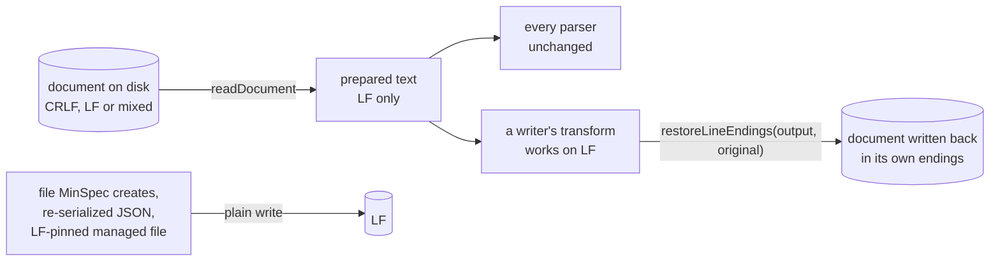

# SPEC-095 - Design: one helper prepares every document read and restores every write

Plan for [requirements.md](requirements.md), built under the ten recorded Clarify selections
(Option A for DQ-1 to DQ-10). It covers both slices; Slice 1 (a default Git for Windows
checkout works) is built with it, and Slice 2 (the property is pinned) has its plan here
too. Citations of "today" are against `origin/main` 350c6fa4, the commit this plan was
written on. New code is cited by symbol, because its line numbers move.

## Approach in one paragraph

Text is made line-ending neutral where it enters and put back where it leaves, and nowhere
in between. A new module, `packages/minspec/src/lib/text-io.ts`, owns three steps:
preparing (CRLF and lone CR become LF, the approval hash's own rule), detecting (which
ending a file uses, and in Slice 2 whether it began with a byte order mark) and restoring
(each line of LF output gets the ending FR-4 assigns it). Every read behind the four tables
of what goes wrong goes through the first step, so every parser downstream sees LF and
needs no change. Every writer that reads a document and writes it back carries what it
read to its write, and the third step gives each line its ending back: a line that stands
in the input keeps its own, a new line takes the file's majority. The functions in the
tables that are handed text rather than a path prepare at their own entry and, where they
return the document, restore at their own exit, so each row holds for the function itself
and not only for the extension's callers. Files MinSpec creates, the JSON it re-serializes
and the managed files its own `.gitattributes` block pins stay LF, as FR-5 says.

## What Plan found that the spec did not know

The spec's Context was read at `5fc471cd`. Main has moved since, and building against it
showed nine facts that change how the requirements are met. None changes a requirement.

1. **The lines moved; the sites did not.** SPEC-096 (the opt-in guard, #2510) routed every
   directory creation through `ensureDirectory` in many of the same files, SPEC-086 deleted
   the ScroogeLLM bridge, and #2481 added two validator warnings. Every row of the four
   tables still exists, with the same shape. Re-derived on 350c6fa4:

   | Context row | Today |
   |---|---|
   | `listAdrs`, `adrHasFrontmatter`, `validateDrIndexStatus`, `validateDrAmendments`, `extractExistingSummary` | `packages/minspec/src/lib/adr-manager.ts:1363-1415`, `:616-622`, `:1217-1296`, `:263-365`, `:973-980` |
   | `setAdrStatus`, `regenerateDrIndex`, `mergeDrIndex`, and the record read behind the INDEX summary (`renderDrEntry`) | `adr-manager.ts:777-834`, `:1134-1157`, `:1089-1114`, `:1000-1053` |
   | `listEpics`, `readArtifactEpic`, `setArtifactEpic`, `setEpicStatus`, `setEpicOrder`, `mergeEpicIndex`, `writeEpicIndex` | `packages/minspec/src/lib/epic-manager.ts:105-162`, `:283-292`, `:260-279`, `:298-322`, `:330-348`, `:625-638`, `:641-650` |
   | `buildArtifactGraph` | `packages/minspec/src/lib/artifact-graph.ts:490-584` |
   | `inspectStatusLine` (its head-callout fallback is the `:189` row), `checkStatusParity`, `inspectAllStatusClaims` | `packages/minspec/src/lib/status-parity.ts:142-194`, `:225-245`, `:292-306` |
   | `parseSections`, `hashSection`, `mergeFile`, `splitManagedRegion`, `spliceManagedRegion` | `packages/minspec/src/lib/merge-refresh.ts:219-246`, `:311-313`, `:700-1132`, `:1570-1596`, `:1609-1622` |
   | `parseConstitution`, `compactConstitution`, `integrateProposal` | `packages/minspec/src/lib/constitution.ts:128-140`, `constitution-compaction.ts:43-75`, `constitution-proposer.ts:329-383` |
   | `seedConstitution`, `buildTasksMdContent`, `findSpecDirsMissingTasksMd`, `ensureGitattributesEntries`, `ensureGitignoreEntries` | `packages/minspec/src/lib/scaffold.ts:73-87`, `:138-164`, `:220-273`, `:356-380`, `:514-545` |
   | `migrateLegacyClaudeSlashCommandShims`, `refreshManagedRegionTemplates`, `checkManagedRegionMarkers`, `refreshHarnessFiles` | `scaffold.ts:881-907`, `:1029-1075`, `:1153-1182`, `:1603-1817` |
   | `collectArtifacts` and the two reads behind it, `applyBackfill` | `packages/minspec/src/lib/epic-backfill.ts:336-338`, `:201-268`, `:315-333`, `:712-784` |
   | `setSpecStatus`, `setSpecPhases`, `advanceSpecToImplementing`, `writeSpec`, `writeSpecFile` | `packages/minspec/src/lib/spec.ts:554-591`, `:646-696`, `:733-803`, `:415-455`, `:480-482` |
   | `writeSpecKitDir`, `migrateLayout`, the spec panel's checkbox write | `spec-layout.ts:273-294`, `spec-manager.ts:640-698`, `packages/minspec/src/views/spec-panel.ts:156-176` |
   | `injectAgentsSlashSection`, `injectContext`, `removeContext`, `appendToParkingLotFile` | `slash-commands.ts:325-346`, `context-injector.ts:58-76`, `:82-99`, `parking-lot.ts:195-220` |

   The commit gate now hands its text to the four functions FR-2 names at
   `scripts/validate-frontmatter.ts:440` (`checkReferences`, a Slice 2 reader),
   `:492` (`checkStatusParity`), `:506` (`inspectAllStatusClaims`) and `:517`
   (`inspectStatusLine`).

2. **#2481 added two detectors that carry their own line-ending tolerance.**
   `detectDoubledFrontmatter` (`adr-manager.ts:511-540`) compares fence lines with a
   trailing CR stripped, and `detectDoubledTemplateHeadings` (`merge-refresh.ts:287-305`)
   splits on any ending. They read damage already on disk (#2467), which DQ-9 leaves out of
   this change, and they are correct for CRLF and mixed files as written, so Slice 1 leaves
   them alone. They are exactly the "private normalizer beside the module" FR-10's second
   pin exists to find: Slice 2 routes both through the helper's preparing step (behaviour
   is unchanged for CRLF and mixed, and a lone-CR file becomes detectable) rather than
   listing them as exceptions. DQ-9's cost is smaller than the spec states: a record with
   two blocks and a doubled harness file are now warned about by `npm run validate`.

3. **SPEC-096 is untouched by this change.** No write here creates a directory: a document
   is written back only over the file it was read from, and a file MinSpec creates still
   goes through the creator that already guards its directory. `ensureDirectory` stays the
   only way anything is created under `.minspec/`.

4. **A parsed spec forgets its line endings.** `parseSpec` normalizes into `raw`, which
   every validator reads, so the writers behind `writeSpec` have nothing to restore from.
   Re-reading the file at write time does not work either: the spec panel's suite
   (`packages/minspec/tests/spec-panel-class.test.ts`) replaces `fs` with a stub that has
   only `writeFileSync`, and AC-19 needs it to pass unmodified. So `ParsedSpec` gains one
   optional field, `source`, the text exactly as `parseSpec` was handed it, the same way
   #2324 added `extraFrontmatter` without touching any construction site. A spec built in
   memory, or merged from a spec-kit directory, has none, and is written LF.

5. **A spec-kit directory is restored file by file.** Restoring all three shards against
   their concatenation would pair a blank line in `plan.md` with one in `spec.md` and move
   endings between files a write did not change (INV-6). `writeSpecKitDir` therefore
   restores each shard against that same file on disk, and against the spec's `source`
   only for a file that does not exist yet, which is a layout migration (FR-5(a)).

6. **Status parity's head callout is read inside `inspectStatusLine`.** The `:189` row is
   that function's fallback, reached by `checkStatusParity`. Preparing at
   `inspectStatusLine`'s entry covers both, and the commit gate's direct call at
   `scripts/validate-frontmatter.ts:517`.

7. **One Refresh is not a fixed point when it seeds a new DRAFT.** Measured on LF:
   `seedConstitution` runs after the merge, so a DRAFT it adds reaches `.cursorrules` on the
   next Refresh, not this one. It is not a line-ending defect and is out of scope; it is
   filed separately, and the behaviour test settles its fixture with two Refreshes.

8. **Five of the 23 `affects:` files need no edit in Slice 1.** `buildArtifactGraph` reads
   decisions and epics through `listAdrs` and `listEpics`, so fixing those fixes the
   signpost. `packages/minspec/src/commands/constitution.ts` hands its reads whole to
   `integrateProposal` and `compactConstitution`, which prepare at entry and restore at
   exit, so the bytes it writes are already the document's own. `commands/adr.ts` changes
   only for FR-6, in Slice 2. `constitution-nudge.ts` and `template-engine.ts` are DQ-10
   files and wait for Slice 2, although both now read the constitution through
   `parseConstitution`, which prepares.

9. **The #2404 commit is still not on `main`.** `814ce538` exists as a local object and on
   no remote branch, and #2404 is open. Slice 1 does not depend on it (Delivery slices).

## Architecture



### The module (FR-1)

```ts
// packages/minspec/src/lib/text-io.ts - no `vscode`, no platform branch, no dependency.
export type LineEnding = '\r\n' | '\n' | '\r';

/** Preparing: every CRLF and every lone CR becomes LF (Slice 2 adds the mark step first). */
export function prepareText(raw: string): string;

/** Detecting: the ending most terminated lines use; a tie, or no terminator, is LF (FR-4). */
export function lineEndingOf(original: string | readonly string[]): LineEnding;

/**
 * Restoring: each terminated line of `lfText` keeps the ending its text had in `original`
 * (occurrences of the same text paired in order), and every other line takes the
 * majority. An LF original makes this the identity, byte for byte (FR-11).
 */
export function restoreLineEndings(lfText: string, original: string | readonly string[]): string;

export interface TextDocument { readonly text: string; readonly original: string }
export function readDocument(filePath: string): TextDocument;
export function readDocumentText(filePath: string): string;
export function writeDocument(filePath: string, lfText: string, original: string | readonly string[]): void;
```

`original` takes several texts for one case only: a spec-kit directory migrated to one flat
file, whose input is three files. Their lines are paired in file order and the majority is
counted over all of them.

**The restoring rule, precisely (FR-4).** Split the original into lines with their
terminators. For each distinct line text keep a queue of the terminators its terminated
occurrences had, in order. Split the LF output on `\n`: every piece but the last has a
terminator; it takes the head of its text's queue if there is one, the majority ending
otherwise. The last piece keeps no terminator. A carriage return inside the LF output is
content, not an ending, so an LF original returns the output unchanged even when a caller
passes user text that holds one.

### Where text is prepared (FR-2)

- **At the read**, for every read of a document behind the four tables:
  `readDocument`/`readDocumentText` in place of `fs.readFileSync`.
- **At the entry** of each function in the tables that is handed text: `parseSections`,
  `hashSection` (FR-7), `inspectStatusLine` and `inspectAllStatusClaims` (and so
  `checkStatusParity`), `parseConstitution`, `compactConstitution`, `integrateProposal`,
  `buildTasksMdContent`, `extractExistingSummary`, `mergeFile`, `mergeDrIndex`,
  `mergeEpicIndex`, `injectAgentsSlashSection`, `injectContext`, `removeContext`.
  Preparing twice is harmless: prepared text is LF and preparing LF is the identity.
- **`parseSpec`** keeps its single-point normalization, now a call to `prepareText`, the
  one normalizer FR-1 moves in Slice 1. The other three it lists are in DQ-10 files and
  move in Slice 2.

### Where text is restored (FR-3, FR-4)

| Writer | How the original reaches the write |
|---|---|
| `setAdrStatus`, `setSpecStatus` (both of its writes), `setSpecPhases`, `setEpicStatus`, `setEpicOrder`, `setArtifactEpic`, `regenerateDrIndex`, `writeEpicIndex`, `appendToParkingLotFile`, `seedConstitution`, `ensureGitignoreEntries`, `ensureGitattributesEntries` | the function reads with `readDocument` and writes with `writeDocument` against what it read |
| `mergeFile`, `integrateProposal`, `compactConstitution`, `mergeDrIndex`, `mergeEpicIndex`, `injectAgentsSlashSection`, `injectContext`, `removeContext` | each restores against the text it was handed, so its callers (`refreshHarnessFiles`, `generateSlashCommandShims`, `injectContextToFile`, the constitution commands) write its result unchanged |
| `writeSpecFile`, the spec panel's checkbox write | against `ParsedSpec.source` (finding 4) |
| `writeSpecKitDir` | each shard against that file on disk; a shard file that does not exist yet against the spec's `source` (finding 5) |
| `migrateLayout` | flat to spec-kit: through `writeSpecKitDir`, whose files are new, against the flat spec's `source`; spec-kit to flat: against the three shard files, read before they are removed |
| `refreshManagedRegionTemplates` (the splice and the marker heal) | against the managed file's own bytes, unless the file is LF-pinned (below) |

A writer that compares before writing (`refreshManagedRegionTemplates`,
`generateSlashCommandShims`, `seedConstitution`, `proposeConstitutionDraft`) compares the
bytes it would write with the bytes on disk, so an unchanged document is not rewritten.

### Which writes are LF (FR-5)

- **(a) New files** are written as they are generated, LF, by the creators that exist today
  (`createAdr`, `createEpic`, `createSpec`, `scaffoldTasksMd`, `generateHarnessFiles`,
  `writeManagedFile`). A layout migration's files are the one exception (table above).
- **(b) JSON** state is re-serialized as today.
- **(c) LF-pinned managed files.** `isLfPinnedPath(relPath)` in `scaffold.ts` compiles the
  path patterns of `MINSPEC_GITATTRIBUTES_ENTRIES` (the `eol=lf` entries) once, with a small
  gitattributes glob (`**/`, a trailing `/**`, `*`, `?`), so the set has one source: the
  block Initialize writes. `refreshManagedRegionTemplates` writes a pinned file LF
  throughout, its user lines included (DQ-4), which is what lets a hook that a CRLF
  checkout broke run again after one Refresh. INV-4 rules out asking git at run time; the
  behaviour test asks `git check-attr` on a scaffolded project and requires the two sets to
  be equal, which keeps them in step if either moves.

### Section hashes (FR-7)

`hashSection` hashes `prepareText(body).trim()`. For an LF body that is today's value, so
every manifest entry Initialize or an LF Refresh recorded stays valid. The manifest recorder
and its self-check both go through `sectionHashesFromMarkdown`, which goes through
`parseSections` and `hashSection`, so the two always use the same value. The template
baseline hashes templates held in memory, which are LF, and is unaffected.

### The approval hash (FR-8, INV-1)

Nothing here edits `packages/shared/src/canonical.ts`, `scripts/hooks/canonical.py` or the
embedded copy in `packages/minspec/src/lib/ci-review-templates.ts`, and `packages/shared/src`
is not edited at all. `parseSpec` calls `prepareText`, whose rule is the expression it
replaces. Proof is computed, not argued: the repository's own `npm run facts` is run over
every approval sidecar (`hash`, `approval`) and every spec and decision record (`status`)
before and after the change, and the two outputs must be identical. The behaviour test
also hashes every spec in `specs/` LF and CRLF through both twins.

## Contracts (Slice 1)

- `text-io.ts` as above. Pure apart from the two `fs` wrappers; exported for tests.
- `ParsedSpec.source?: string`, set by `parseSpec` to its input.
- `isLfPinnedPath(relPath: string): boolean`, exported from `scaffold.ts`.
- No other signature changes. In particular `spliceManagedRegion` and `splitManagedRegion`
  keep theirs: they work on prepared text, and the caller that read the file restores it.

## Invariants, checked

- **INV-1 (approval hash).** No edit under `packages/shared/src`; the facts comparison and
  FR-8's named case.
- **INV-2 (no silent gate).** No new `catch`; every read keeps the error handling it had,
  and a reader that skipped an unreadable file still does.
- **INV-3 (blast radius).** A write changes only the lines it means to; the mixed rows
  assert it, and a document a writer did not change comes back byte for byte. No git
  configuration is read or written, and no line-ending policy is written for documents.
- **INV-4 (offline core).** No network, no new child process outside tests, no dependency.
- **INV-5 (no platform branch).** The module looks only at the bytes.
- **INV-6 (what MinSpec did not change, it does not convert).** The restoring rule; the one
  exception is a pinned managed file (FR-5(c)).
- **INV-7 (library boundaries).** `text-io.ts` imports `fs` only; the pinned list of `lib/`
  files that import `vscode` does not change.

## Test plan, placed

- **`packages/minspec/tests/text-round-trip.test.ts`** (FR-9), written first and shown red
  on 350c6fa4 pair by pair: every function in the four tables against the CRLF and mixed
  rows, each with its LF control; the three symptoms #2397 names; AC-2's signpost; FR-5(a),
  (b) and (c) including the `git check-attr` comparison and a CRLF hook that runs after one
  Refresh; FR-7's hash and manifest cases; FR-8 over every spec in both twins; the
  `core.autocrlf=true` end-to-end case; and T1 cases for the module, loaded at run time so
  the rows still run one by one on code that has no module.
- **Existing suites** pass unmodified (AC-19), the canonical suites included (AC-16).
- **Mutation checks** before merging: break the restoring step, and separately revert one
  converted reader to a bare split on `\n`; the rows must go red each time.

## Slice 2 - the property is pinned

1. **Start from the #2404 commit (DQ-8).** If `814ce538` has not merged, cherry-pick it
   unmodified as the slice's first commit; it is the only change in either slice that
   touches the three hash files, and it carries its own golden pair. Then move its
   leading-mark strip out of `parseSpec` and into `prepareText`, unchanged, and teach
   `restoreLineEndings` to put a mark back when the original began with one and never to
   add one (DQ-3). `canonicalizeSpec` keeps its own copy (FR-8).
2. **Add the three rows to `VARIANTS`:** lone CR, a leading mark with LF, and a leading mark
   with CRLF. Every listed function meets them by name; the expectations are already
   computed generically.
3. **Route the reads of the five DQ-10 files through the module:** `artifact-graph.ts`
   (`frontmatterBlock`, `:105-108`, and the read at `:162`), `auto-bootstrap.ts` (the
   either-ending patterns in `isPristineDesignStub`, `:454-477`), `constitution-nudge.ts`
   (the rescan, `:95-126`), `reference-checker.ts` (`extractReferences`, `:117-123`) and
   `template-engine.ts` (the recorded project name, `:58`, `:66-70`). Also the readers of
   the survive-CRLF table that sit in files Slice 1 touched and still read raw text:
   `fileEntryExists` (`parking-lot.ts:98-111`) and the spec id sniff behind `nextSpecId`
   (`spec-manager.ts`), plus the two #2481 detectors (finding 2).
4. **FR-6.** `setAdrStatus` decides by the record's first non-blank line, a leading mark
   ignored: not `---` means synthesize, `---` with no parseable block means throw, name the
   file and write nothing. `applyStatus` (`commands/adr.ts:199-280`) then shows that error
   and no "predates MinSpec" offer. The suites that pin the synthesize branch for a record
   that opens with `---` change, as AC-19 allows.
5. **FR-10.** `packages/minspec/tests/text-io-inventory.test.ts`, the two-pin inventory,
   shown to fail on the code before it. Its exclusions follow the source-scan invariants in
   `packages/minspec/tests/invariants.test.ts` (whose allowlist is now `SPAWN_ALLOWLIST`).
6. **Acceptance:** AC-1, AC-5, AC-11, AC-14, AC-18 and the rest of AC-17.

## Risks

- **A writer added later that forgets to restore.** Until Slice 2's inventory lands, only
  review and the round-trip rows stand in the way, and a row exists only for a function the
  tables name. That is the reason the inventory is Slice 2's first deliverable after the
  mark.
- **Pairing repeated lines by order** can give two identical lines each other's endings
  after an insertion. It changes no content and only lines whose text repeats, mostly blank
  lines; DQ-2 accepted the cost.
- **A mixed file stays mixed.** By design (DQ-2): the rule does not unify a file a past
  build left mixed, and git keeps warning about such a file until someone fixes it.
