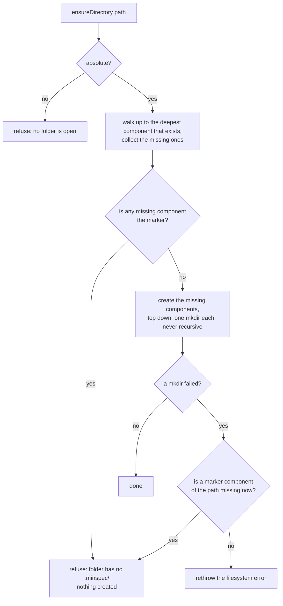
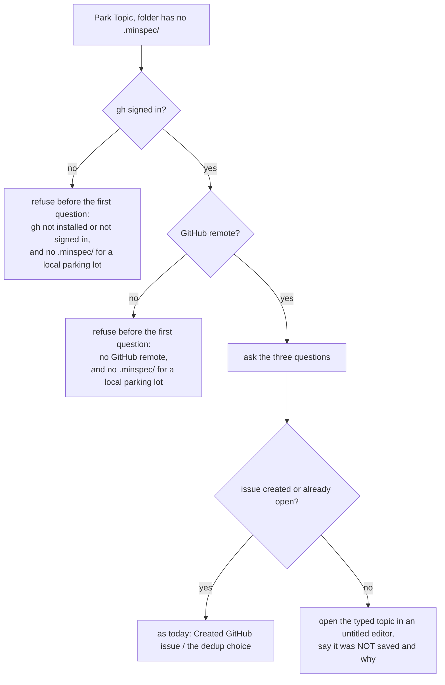

# SPEC-096 - Design: only Initialize creates the .minspec/ opt-in marker

Plan for [requirements.md](requirements.md), built under the six recorded Clarify selections
(Option A for DQ-1 to DQ-6). Citations of "today" are against `origin/main` a024a751, the
commit this plan was written on. The spec took its line numbers on ff968418 and 32 commits
have landed since; "Reconciliation with main" gives what moved. New code is cited by symbol,
because its line numbers move.

## Approach in one paragraph

The defect is not ten writers, it is that any writer may call `mkdir -p` on a path under
`.minspec/`, and the marker is whatever directory that call leaves behind. So the plan takes
the capability away instead of asking each writer to check first. One new module,
`lib/opt-in.ts`, holds the predicate, the refusal and one directory operation,
`ensureDirectory`, which walks a path one level at a time and will not create a component
named `.minspec`. Every directory the extension creates inside a workspace folder goes
through it: 26 call sites in 20 files change, and after that a direct call to a
directory-creating API exists in five named files and nowhere else, which a test checks by
parsing the source. That alone makes the marker un-manufacturable, but it would leave three
commands asking their questions and then failing, and Approve flipping a spec's status
before the store refused. So the commands that reach a `.minspec/` store before opt-in also
check as soon as they know their folder, and show one message with no button. Refresh
Harness Files stops calling the creator at all.

## What Plan found that the spec did not know

Twelve facts, each checked against the code. None changes a requirement.

1. **Writer row 8 no longer exists.** The build of SPEC-086 (removal of the ScroogeLLM
   upsell), commit 4d971269, pull request #2492, deleted `packages/minspec/src/lib/bridge.ts`,
   the Export Traceability command and the conformance watcher. A writer that does not exist
   needs no guard. What follows from it: the population is 32 directory-creating calls in 22
   files, not 33 in 23; the manifest contributes 44 commands, not 45; FR-6 has five commands
   to check, not six; FR-8's "two ambient paths" is one (the presence heartbeat); and the
   test's "21 of the 23 files" is 20 of the 22. DQ-6 Option A anticipated exactly this.

2. **A third ambient path appeared, and it is already behind the predicate.** The fix for
   issue #2461 (the decisions watcher rewrote `docs/decisions/INDEX.md` in any folder),
   commit 5fc471cd, pull request #2478, gated the watcher's write on `isMinspecInitialized`
   (`packages/minspec/src/extension.ts:565`). The spec lists that issue as out of scope
   under DQ-5; it has since been fixed on `main`. `regenerateDrIndex` still creates its
   directory, so under FR-4 it moves to the shared operation like the other artifact
   writers, and the watcher stays silent as before.

3. **The marker has more than one spelling on some disks.** The predicate asks the
   filesystem whether `.minspec` exists. On a case-insensitive volume (the macOS and Windows
   defaults) a directory created as `.MINSPEC` answers yes, and Windows drops trailing dots
   and spaces from a name, so `.minspec.` is the same directory there. A guard that compared
   the name exactly would let `minspec.specsDir: ".MINSPEC/specs"` manufacture the marker on
   those disks, which is the settings route the spec measured, in another case. The
   operation therefore refuses a component whose name, lower-cased and with trailing dots
   and spaces removed, is `.minspec`, on every platform. The cost is that on a case-sensitive
   disk the extension will not create a directory literally named `.MINSPEC` for the user,
   which nothing does today.

4. **The refusal has to come before the FIRST create, not at the marker.** Asked for
   `proj/sub/.minspec/queue` where `proj/` does not exist either, a walk that creates each
   level as it goes would make `proj/` and `proj/sub/` and only then meet the marker. FR-2
   (b) says "creates nothing". The operation therefore looks at the whole path first and
   creates only if no missing component is the marker.

5. **Refresh should not merely check before calling the creator, it should not call it.**
   `refreshHarnessFiles` begins with `scaffold(rootDir)`
   (`packages/minspec/src/lib/scaffold.ts:1577-1578`). A check placed in front of that call
   still leaves a recursive `mkdir` of `.minspec` reachable from Refresh if the marker goes
   between the check and the call. `scaffold()` is split: the one creating call stays in it,
   and what it writes beside the marker (the default `config.json`, the epic index) moves to
   a helper that creates no marker. Refresh checks, then calls only the helper. With the
   marker present the two orders write the same bytes. The callers of `scaffold()` are then
   Initialize and the harness generator Initialize runs, and the inventory test pins that.

6. **Approve needs the check twice.** FR-6 puts it "as soon as its target folder is known",
   which is before the spec picker. The picker then waits for the user, and the status flip
   follows it (`packages/minspec/src/commands/approve.ts:345`). If the marker goes while the
   picker is open, the store's refusal arrives after the spec file has been rewritten: a
   spec that reads as approved with nothing behind it, which is the state the spec's
   "Alternatives considered" rejects a store-only check for. A second check immediately
   before the flip closes it.

7. **The classify toast has two persisting buttons, and FR-8 names one.**
   `packages/minspec/src/commands/classify.ts:175` (the raise-tier button, a store in FR-5)
   is on FR-8's list. `:194` (the auto-classify button, the preference store) is not,
   because that store already refuses. But it has no handler either, so the same click in
   the same toast ends in a rejected command. Both branches get the same handler. This is
   one of "the messages FR-8 adds where a marker was removed while a prompt was open"
   (FR-13).

8. **FR-12 requires a file the spec's `affects:` does not list.** The README sentence about
   the Park Topic fallback, now at `packages/minspec/README.md:64` (the build of SPEC-085
   rewrote that section and moved it from `:39`). The edit is the one sentence FR-12 words.
   It was confirmed with the session that dispatched this build before it was made. The
   changelog entry FR-12 also requires was in the dispatch from the start.

9. **Existing tests lean on a store or a command creating `.minspec/`.** The spec's
   frontmatter says which ones is a Plan-phase measurement, and its Test plan says such
   fixtures "create it themselves". The measured list, with a reason per file, is under
   "Existing tests that change". The same confirmation covered these, with two conditions:
   no assertion is weakened, removed or re-pointed, and a test that was the only thing
   exercising a store with no marker keeps that coverage in the new invariant tests.

10. **Two decision commands reach the refusal through a setting, and their file is not in
    `affects:`.** With `minspec.decisionsDir` pointed inside `.minspec/`, Create ADR and
    Regenerate Decision Register INDEX reach the guard through `createAdr` and
    `regenerateDrIndex`. `packages/minspec/src/commands/adr.ts` already catches any error
    and shows it (`:103-106`, `:345-348`), so the refusal reaches the user inside that
    command's own failure sentence: "MinSpec: Failed to create ADR - " followed by the
    refusal. It names the folder, says the marker is absent and names Initialize, and no
    success message follows, which is what FR-6's last paragraph asks. It is not the bare
    refusal, and the product name appears twice. Tidying that needs a file outside this
    change, tracked as a follow-up.

11. **`minspec.approveActive` is a router, and it is classified by where it routes.** Alt+A
    runs Approve Spec, Accept Decision or Accept Epic depending on what is in focus. With
    nothing approvable in focus it runs Approve Spec, so in the folders the command test
    uses it reaches FR-6's refusal and is classified with the refusing commands. With a
    decision or an epic in focus it writes into `docs/`, which is DQ-5's subject.

12. **One mutant is equivalent.** Propose Constitution has a command check and, behind it,
    a write that goes through the guard. Removing the command check alone changes nothing a
    user or a test can observe: the guard refuses with the same message and the folder is
    untouched. Removing both turns the command test red. The Test plan asks for "a mutant
    per store and per command check"; this is the one command check whose mutant cannot be
    killed, and the pull request says so instead of reporting it as killed.

## Reconciliation with main

The property the spec states binds this plan. Its line numbers do not, and these are the
ones it relies on, re-derived on a024a751.

| Spec cites (ff968418) | Now | What |
|---|---|---|
| `preferences.ts:159-161`, `:168-177`, `:192-203` | unchanged | the predicate, the refusal error, `savePreferences` |
| `classifier.ts:248-255` | unchanged | `saveCalibration` |
| `parking-lot.ts:190-217`, `:244-272` | unchanged | the local fallback, `parkTopic` |
| `approval.ts:102-112`, `:140-153`, `:524-528`, `:579`, `:590` | unchanged | the gzip fallback, the blob and ref, the approver gate, the mint, the record |
| `approval-store.ts:160-164` | unchanged | `writeRecord` |
| `traceability.ts:82-87` | unchanged | `saveTraceability` |
| `bridge.ts:182-199`, `:231-237` | deleted by 4d971269 | row 8 and its watcher |
| `merge-refresh.ts:1348-1359`, `:1396-1400` | `:1407-1418`, `:1455-1459` | `saveHashes`, `saveTemplateBaseline` |
| `scaffold.ts:385-387` | unchanged | the creator |
| `scaffold.ts:804`, `:1487`, `:1658` | `:803`, `:1486`, `:1657` | the three template and managed-file writes |
| `scaffold.ts:1577-1579` | `:1576-1578` | Refresh calls the creator |
| `adr-manager.ts:520`, `:1068` | `:589`, `:1137` | `createAdr`, `regenerateDrIndex` |
| `presence.ts:574`, `:701`, `:706`, `:728` | unchanged | the stale comment, the gate, the mkdir, the rename |
| `extension.ts:370-377`, `:437-449` | `:378-385`, `:455-468` | the Refresh and command registrations |
| `extension.ts:375` | `:383` | the comment saying Refresh can run before opt-in |
| `extension.ts:1048`, `:1056` | `:1041`, `:1049` | the two drift-warning actions |
| `init.ts:1488-1494` | `:1481-1494` | `initRefreshCommand` |
| `README.md:39` | `:64` | the Park Topic sentence |
| `invariants.test.ts`, `CHILD_PROCESS_ALLOWLIST` | `SPAWN_ALLOWLIST` | renamed by the fix for issue #2456, pull request #2473 |

No writer was found on a024a751 that the spec did not see. The count was taken again by
parsing every file under `packages/minspec/src` and `packages/shared/src`: 29 `mkdirSync`, 2
`mkdtempSync` and 1 `renameSync`, and no use of `vscode.workspace.fs`, a workspace edit, `cp`,
`symlink`, or any callback or promise form.

## The guard



Three properties come from the shape, not from a check that could be skipped.

- **It cannot create the marker.** The only `mkdir` in the module is never called for a
  component that is the marker, and it is never recursive, so no parent is created as a
  side effect.
- **It creates nothing when it refuses.** The look comes first and covers the whole path.
- **The race has two outcomes.** If the marker goes after the look, the next `mkdir` has no
  parent and fails with `ENOENT`. The operation then looks again: when a marker component
  of the path is missing it throws the refusal, so the caller gets the same message a
  folder that never opted in gets; otherwise the filesystem error stands, because it is
  about something else.

Who may create a directory, after this change:

| Where | Direct call | Why it stays |
|---|---|---|
| `lib/opt-in.ts`, `ensureDirectory` | 1 `mkdirSync` | The operation itself |
| `lib/scaffold.ts`, `scaffold` | 1 `mkdirSync` | The creator: the opt-in |
| `lib/approval-recover.ts` | `mkdtempSync`, `mkdirSync` | A git worktree under the OS temp directory |
| `commands/push-docs-lane.ts` | `mkdtempSync`, `mkdirSync` | The same |
| `lib/presence.ts`, `writeHeartbeat` | 1 `renameSync` | A file renamed inside `.minspec/sessions/` |

Everything else calls `ensureDirectory`. The 26 converted calls:

| Group (FR-4) | Calls | Files |
|---|---|---|
| A `.minspec/` store with no marker check | 10 | `session.ts`, `classifier.ts`, `parking-lot.ts`, `approval.ts`, `approval-store.ts`, `phase-advance-queue.ts`, `traceability.ts`, `merge-refresh.ts` (2), `commands/constitution.ts` |
| Under `.minspec/`, already behind the predicate | 2 | `auto-bootstrap.ts`, `presence.ts` |
| The parent of a template or managed file | 3 | `scaffold.ts` |
| The specs, decisions or epics directory | 7 | `commands/example.ts`, `adr-manager.ts` (2), `epic-manager.ts` (2), `spec-manager.ts`, `spec-layout.ts` |
| A fixed tool directory | 4 | `claude-settings.ts`, `slash-commands.ts` (2), `context-injector.ts` |

For the last eleven nothing changes except in the settings route. For a store directly
under the marker the call is `ensureDirectory(<root>/.minspec)`: a no-op when the marker
exists and the refusal when it does not, which is how a store "stops holding its own
`mkdir`, and that is all" (FR-5).

## Contracts

```ts
// packages/minspec/src/lib/opt-in.ts - imports `fs` and `path`, nothing else.

/** Palette title of the one command that opts a folder in. Pinned to the manifest by test. */
export const INITIALIZE_COMMAND_TITLE = 'MinSpec: Initialize SDD Structure';

/** True when rootDir is not empty and <rootDir>/.minspec exists. The ONE definition. */
export function hasOptInMarker(rootDir: string): boolean;

/** The refusal's wording (FR-8). `notWritten` is what did not happen, for the one
 *  caller whose write was a preference. */
export function notOptedInMessage(rootDir: string, notWritten?: string): string;

/** Thrown by every refusal. `rootDir` is the folder that has not opted in, '' for none. */
export class NotOptedInError extends Error {
  readonly rootDir: string;
  constructor(rootDir: string, notWritten?: string);
}

/** Throw the refusal unless the folder has opted in. For a side effect that is not a mkdir. */
export function assertOptedIn(rootDir: string): void;

/** FR-2: create a directory and its missing parents, never a component named .minspec. */
export function ensureDirectory(dirPath: string): void;
```

`preferences.ts` re-exports `hasOptInMarker` and `NotOptedInError` from it, and
`auto-bootstrap.ts` keeps re-exporting from `preferences.ts`, so every existing importer is
untouched and there is one definition (FR-1). `presence.ts` imports the predicate from the
new module directly; its header already requires that the predicate live in a module with no
other imports, and the new module has fewer than `preferences.ts`.

`ensureDirectory` takes the directory and not the folder root. The folder named in a refusal
is derived from the path (the parent of the missing marker component), so a caller cannot
pass a root that disagrees with the path it is about to write.

## The refusals

One message, shown as an error, with no button (DQ-2):

```
MinSpec: <folder> has no .minspec/ directory (it has not opted in), so nothing was written there. Run "MinSpec: Initialize SDD Structure" first.
```

For the empty root (no folder open): `MinSpec: no folder is open, so there is no project to
write to.` The preference store is the one caller that passes its own clause, "so no
preference was saved there", because there a preference was the write (FR-8). The words "it
has not opted in" are kept from today's message; an existing test matches on them.

Where each command checks, and what else it does there:

| Command | Check | Before it |
|---|---|---|
| Declare Session Scope | after the folder is resolved | nothing |
| Link Code to Spec Requirement | after the no-folder check | nothing: it precedes "No active editor" |
| Propose Constitution (draft) | after the folder is resolved | nothing |
| Approve Spec | after the folder is resolved, and again before the status flip | the spec picker only (finding 6) |
| Refresh Harness Files | after the folder is resolved; `refreshHarnessFiles` also refuses | nothing |

Where a store's refusal is caught and shown, because the marker can go while a prompt is
open (FR-8's six call sites, plus finding 7):

| Call site | Shows | Success message suppressed |
|---|---|---|
| `commands/session.ts`, the save | the refusal | "Session started" |
| `views/codelens-provider.ts`, the save | the refusal | "Linked" |
| `commands/classify.ts`, both buttons | the refusal (the preference clause for auto-classify) | "Raised to", "enabled" |
| `extension.ts`, Add to Scope | the refusal | "Added to session scope" |
| `extension.ts`, Park as Issue | the refusal | "Saved to" |
| `commands/park.ts`, both calls | the Park message below, and the typed text | "Saved to" |
| `commands/example.ts` (settings route) | the refusal | "Generated example spec" |

Only `NotOptedInError` is caught at these sites. Any other error propagates as it does today
(FR-13).

Two existing wrappers are left as they are, because at that point something may already have
been written and the bare refusal would say otherwise. `initRefreshCommand` reports a failure
from inside `refreshHarnessFiles` as "Harness refresh failed ... Some files may be partially
written", and `approveSpecCommand` reports one from inside the approval as "Failed to
approve". Both can only carry a refusal if the marker is deleted in the middle of a
synchronous sequence; the command's own check has passed by then.

### Park Topic (FR-7, DQ-3)

With the marker present nothing changes. Without it:



The `gh auth status` probe and the remote lookup run earlier than they do today in this one
case, and still only after the user invoked the command (INV-1). In the library, `parkTopic`
is unchanged in shape: with no marker its local fallback throws the refusal, which is what
the command catches to hand the text back. The untitled document carries the title, the
context, the labels and the session scope.

## Order of work

1. The three tests the spec owns, red on a024a751.
2. This plan and the task list.
3. `lib/opt-in.ts`, with `preferences.ts` re-exporting from it.
4. The stores: the ten writers, `approveSpec`'s own refusal, and the two already behind the
   predicate.
5. Refresh: the `scaffold()` split, the refusal in `refreshHarnessFiles`, the three template
   writes.
6. The artifact and tool directories, which closes the settings route.
7. The commands: the checks, the handlers, Park Topic.
8. The words: the eight comments, the README sentence, the changelog.

Each step keeps the fixtures of the tests it breaks in the same commit.

## Test plan

T0, written before any source change and observed on a024a751:

- `packages/minspec/tests/opt-in-guard.test.ts` (FR-11, FR-1, FR-8). Real temp directories.
  The race is produced by a passthrough over `fs` that runs a hook immediately before the
  Nth real `mkdir`, and the hook records that it fired. It cannot load today, because the
  module it tests does not exist: that is its red, and it is the only red available to a
  contract test for a new module.
- `packages/minspec/tests/opt-in-writer-inventory.test.ts` (FR-9, FR-3, FR-5). The scanner
  is first pointed at invented inputs that contain what it looks for, so a clean result on
  the real tree is not a reader that sees nothing. Beyond the spec, it reports the three
  plain ways of carrying a directory-creating function off under another name, pins the
  enclosing function of each allowed call and not only the count, and pins who calls
  `scaffold()`. Its third part drives each store directly. Today 25 of 60 fail.
- `packages/minspec/tests/commands-opt-in-invariant.test.ts` (FR-10, FR-6, FR-7, FR-8). The
  real `activate()`, all 44 contributed commands through the handlers it registers, real
  folders, prompts answered, only `vscode` and the child-process boundary stubbed. A handler
  that rejects fails the test, so a pass cannot come from a gap in the stand-in for the
  editor. Today 51 of 182 fail, each because the marker was created or the refusal was not
  shown.

What varies, because the earlier instances of this defect were fixture-shaped: the marker
(absent; present; present but holding only `preferences.json`, the residue issue #2365
describes, which still counts as opted in because the marker's definition does not move,
INV-4), the root (a folder; no folder at all), the folder (empty; primed; primed with the two
directory settings inside `.minspec/`; primed with no git repository), and the workspace
(one folder; two, one opted in and one not).

Not vacuous, each with a clean control run before and after:

- remove the guard from a converted writer, and a test goes red;
- add a new `mkdir` of a `.minspec/` path outside the guard, and a test goes red;
- remove each command check and each store refusal in turn (finding 12 names the one that
  is equivalent).

The final versions of the three files are run against an export of a024a751, so the red
evidence is for the tests as merged and not for an earlier draft.

### Existing tests that change

`bootstrap-opt-in-invariant.test.ts` and `presence-opt-in-invariant.test.ts` are not edited.
Every other change to an existing test is a fixture precondition: one `mkdir` of `.minspec`
where a real temp folder is used, or a statement of the opted-in precondition where a mocked
root is. No assertion is weakened, removed or re-pointed. The list is measured in task 4 by
running the suite against the guard and reading each failure, and is recorded here with the
reason per file and the count.

## Invariants

- **INV-1.** No network call, no new child process, no new entry in `SPAWN_ALLOWLIST`. The
  new module imports `fs` and `path`. Park Topic's probe moves earlier in one case and stays
  behind the user's invocation.
- **INV-2.** Every refusal is a throw or a visible message. No new `catch` returns a
  success-shaped value: the new handlers show the refusal and return without the success
  message. The two tests that scan fail on an unreadable file and on an empty scan.
- **INV-3.** Writes are removed and none is added. Nothing is stored in editor storage in
  place of a refused write.
- **INV-4.** The predicate's body is moved, not changed. A folder holding only
  `preferences.json` under `.minspec/` is opted in, as today.
- **INV-5.** With the marker present every store writes the bytes it wrote before; the
  store-level tests assert them, and they pass on a024a751 as well.
- **INV-6.** A refusal follows something the user just did. Nothing is added at activation.
- **INV-7.** `@aiclarity/shared` is untouched. The new module is in `lib/` and imports
  neither `vscode` nor anything from `views/` or `commands/`.

## Dependency budget

Zero. `typescript`, used by two of the tests to read syntax trees, is already a development
dependency and already imported by four other test files.

## Costs and risks carried forward

- **Refusing commands stay visible in the palette** (DQ-2's recorded cost). A user in a
  folder that has not opted in can run five commands whose only answer is the refusal.
- **A user without `gh` cannot park anything before Initialize** (DQ-3's recorded cost).
- **Anyone who used Refresh to set a folder up gets a refusal and one more step** (DQ-1's
  recorded cost).
- **The check costs one `existsSync` per command and per store write.** Negligible, and not
  cached, so a folder that opts in or out is seen at the next call.
- **A refusal inside Create ADR or Regenerate INDEX is wrapped** (finding 10).
- **The inventory matches by name.** A wrapper in another package, or a computed property
  name, gets past it. The command test's directory listings are the backstop.
- **`ownership-advance-guard.ts` has its own walk up to a `.minspec` directory.** It finds a
  project root for a spec file and decides nothing about opt-in. It is left alone, and it is
  the one other place in the source that reads the marker by name.
- **Pull requests that touch the same files will conflict.** 29 source files change by a
  line or two each.

## Follow-ups (tracked)

- #2365 - folders an earlier build marked by accident stay opted in. Held for a human
  decision; nothing here treats such a folder differently.
- #2462 - which commands may write outside `.minspec/` before opt-in. DQ-5.
- #2464 - where the marker is looked for (a sub-folder of an opted-in repository).
- #2367 - cleanup of the pre-opt-in store the fix for #2355 added.
